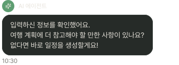
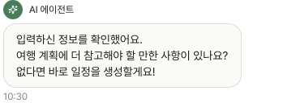

# ChatBubble

## 개요

채팅 화면 메시지 버블. AI 응답(AIAgentChat) / 사용자 입력(UserChat) 두 종류.

## Variants

| Variant | 설명 |
|---|---|
| AIAgentChat / Light | AI 응답, 라이트 |
| AIAgentChat / Dark | AI 응답, 다크 |
| UserChat / Light | 사용자 메시지, 라이트 |
| UserChat / Dark | 사용자 메시지, 다크 |

## AIAgentChat 구성

```
[✦] AI 에이전트
┌──────────────────────────┐
│ 메시지 텍스트              │
└──────────────────────────┘
 HH:MM
```

| 속성 | Light | Dark |
|---|---|---|
| 아이콘 배경 | `Light/Primary,CTA Button` | `Dark/Primary,CTA Button` |
| 버블 배경 | `Light/Surface,Card BG` | `Dark/Surface,Card BG` |
| 버블 border | `1px solid Light/Divider,Border` | `1px solid Dark/Divider,Border` |
| Border Radius | `radius-lg` | `radius-lg` |
| Elevation | `Light/elevation-1` | `Dark/elevation-1` |
| 메시지 | `body-md` / `Light/Title,Body Text` | `body-md` / `Dark/Title,Body Text` |
| 타임스탬프 | `caption` / `Light/Caption,Hint` | `caption` / `Dark/Caption,Hint` |
| 아이콘 색상 | `Light/Surface,Card BG` | `Dark/Title,Body Text` |
| 아이콘 컨테이너 Border | `radius-full` | `radius-full` |
| 아이콘 컨테이너 색상 | `Light/Primary,CTA Button` | `Dark/Primary,CTA Button` |


## UserChat 구성

```
                      사용자 [아이콘]
       ┌──────────────────────────┐
       │ 메시지 텍스트              │
       └──────────────────────────┘
                            HH:MM

```

| 속성 | Light | Dark |
|---|---|---|
| 버블 배경 | `Light/Secondary Surface` | `Dark/Secondary Surface` |
| 버블 Border | `1px solid Light/Divider,Border` | `1px solid Dark/Divider,Border` |
| Border Radius | `radius-lg` | `radius-lg` |
| Elevation | `Light/elevation-1` | `Dark/elevation-1` |
| 메시지 | `body-md` / `Light/Title,Body Text` | `body-md` / `Dark/Title,Body Text` |
| 타임스탬프 | `caption` / `Light/Caption,Hint` | `caption` / `Dark/Caption,Hint` |
| 아이콘 색상 | `Light/Surface,Card BG` | `Dark/Title,Body Text` |
| 아이콘 컨테이너 Border | `radius-full` | `radius-full` |
| 아이콘 컨테이너 색상 | `Light/Primary,CTA Button` | `Dark/Primary,CTA Button` |

## 관련 아이콘 추가후, 경로 추가
`assets/icons/ic_ai.svg`

`assets/icons/ic_user.svg`

## 이미지

### AI Agent Chat Dark/Light



### User Chat Dark/Light

