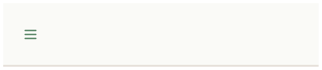
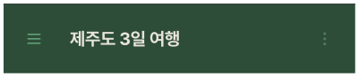
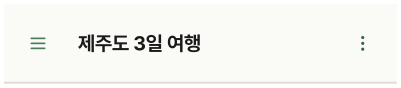

# ChatHeader

## 개요

채팅 화면 상단 헤더. Default(새 채팅) / Active(진행 중) 두 상태.

## Variants

| Variant | 설명 |
|---|---|
| Default / Light | 새 채팅 시작 전, TripInfoBottomSheetCreate 뜰 때 |
| Default / Dark | 새 채팅 시작 전, TripInfoBottomSheetCreate 뜰 때 |
| Active / Light | 채팅 진행 중 |
| Active / Dark | 채팅 진행 중 |

## Default 구성

```
[≡]
```

## Active 구성

```
[≡]   채팅방 이름 텍스트   [⋯]
```

- **좌측 ≡** → NavigationDrawer 열기
- **우측 ⋯** → OverflowMenu 열기

## 스타일

| 속성 | Light | Dark |
|---|---|---|
| 높이 | 78px + `insets.top` | 78px + `insets.top` |
| 배경 | `Light/Surface,Card BG` | `Dark/Primary Tint,Tag BG` |
| 하단 border | `1px solid Light/Divider,Border` | `1px solid Dark/Divider,Border` |
| Elevation | `Light/elevation-1` | `Dark/elevation-1` |
| 여행명 | `heading-lg` / `Light/Title,Body Text` | `heading-lg` / `Dark/Title,Body Text` |
| 아이콘(ic_drawer) 색상(≡) | `Light/Primary,CTA Button` | `Dark/Primary,CTA Button` |
| 아이콘(ic_overflow) 색상(⋯) | `Light/Primary Hover,Active` | `Dark/Primary Hover,Active` |

## Safe Area 처리

Header와 동일하게 `insets.top` 적용 필요.

```tsx
const insets = useSafeAreaInsets();

<View style={{
  height: 78 + insets.top,
  paddingTop: insets.top,
}}>
  {/* 헤더 콘텐츠 */}
</View>
```
## 관련 아이콘 추가후, 경로 추가
`assets/icons/ic_drawer.svg`

`assets/icons/ic_overflow.svg`

## 이미지

### Chat Header Default Dark/Light



### Chat Header Active Dark/Light


