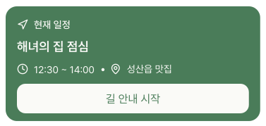

# CurrentScheduleCard

## 개요

PlanScreen 현재 진행 중인 일정 카드.
하단 "길 안내 시작" 버튼으로 외부 지도 앱에서 현재 장소 길 안내 실행.

## Variants

| Variant | 설명 |
|---|---|
| Light | 라이트 모드 |
| Dark | 다크 모드 |

## 구성

```
┌──────────────────────────────┐
│ ✦ 현재 일정                  │
│ 일정명                        │
│ ⏱ HH:MM ~ HH:MM •📍 위치    │
│ ┌────────────────────────┐   │
│ │     길 안내 시작        │   │ ← 외부 지도 앱 열기
│ └────────────────────────┘   │
└──────────────────────────────┘
```

## 스타일

| 속성 | Light | Dark |
|---|---|---|
| 카드 배경 | `Light/Primary,CTA Button` | `Dark/Primary,CTA Button` |
| Border Radius | `radius-lg` | `radius-lg` |
| Elevation | `Light/elevation-2` | `Dark/elevation-2` |
| 일정명 | `heading-md` / `Light/Surface,Card BG` | `heading-md` / `Dark/Surface,Card BG` |
| 시간/위치 | `body-md` / `Light/Surface,Card BG` | `body-md` / `Dark/Surface,Card BG` |
| 길 안내 버튼 배경 | `Light/Surface,Card BG` | `Dark/Title,Body Text` |
| 길 안내 버튼 텍스트 | `body-lg` / `Light/Primary,CTA Button` | `body-lg` / `Dark/Primary,CTA Button` |
| 길 안내 버튼 Border Radius | `radius-md` | `radius-md` |
| 길 안내 버튼 Elevation | `Light/elevation-2` | `Dark/elevation-2` |
| 아이콘 색상 | `Light/Surface,Card BG` | `Dark/Title,Body Text` |

## 길 안내 구현
*해당 파트 구현하시는 분이 해보시고 안 되면 다른 방법으로 가셔도 됩니다. 예시일뿐...*

카카오맵 우선, 미설치 시 구글맵으로 폴백.

```tsx
import { Linking } from 'react-native';

const openNavigation = (lat: number, lng: number, placeName: string) => {
  const kakaoUrl = `kakaomap://look?p=${lat},${lng}`;
  const googleUrl = `https://www.google.com/?q=${lat},${lng}`;

  Linking.canOpenURL(kakaoUrl).then(supported => {
    Linking.openURL(supported ? kakaoUrl : googleUrl);
  });
};
```

## 관련 아이콘 추가후, 경로 추가
`assets/icons/ic_navigation.svg`

`assets/icons/ic_clock.svg`

`assets/icons/ic_pin.svg`

## 이미지

### Current Schedule Card Dark


### Current Schedule Card Light
