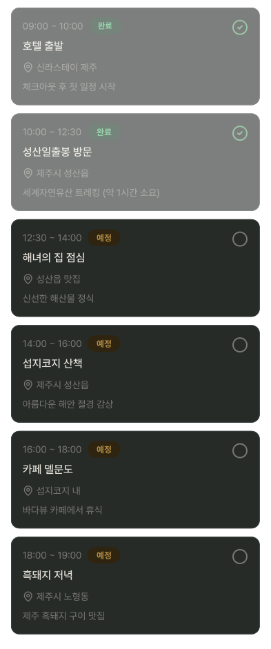
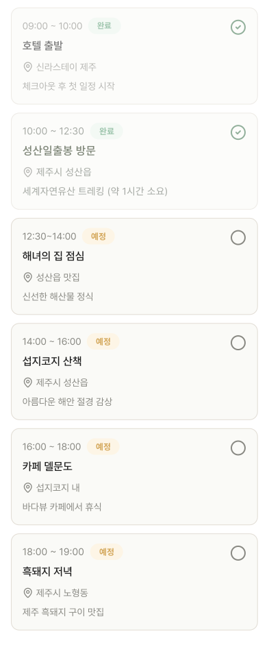

# DayScheduleItem

## 개요

PlanScreen 일별 일정 카드 목록.

시간, 장소명, 위치, 메모, ScheduleStatusBadge, CheckButton 포함.

완료된 항목은 `opacity: 0.6`으로 흐리게 표시.

## Variants

| Variant | 설명 |
|---|---|
| Light | 라이트 모드 |
| Dark | 다크 모드 |

## 카드 구성

```
┌─────────────────────────────────────┐
│ HH:MM ~ HH:MM  [예정/완료]    [○/✓] │ ← 시간 + StatusBadge + CheckButton
│ 일정명                               │
│ 📍 위치                             │
│ 메모 텍스트                          │
└─────────────────────────────────────┘
```

## 스타일

| 속성 | Light | Dark |
|---|---|---|
| 카드 배경 | `Light/Surface,Card BG` | `Dark/Surface,Card BG` |
| 카드 border | `1px solid Light/Divider,Border` | `1px solid Dark/Divider,Border` |
| Border Radius | `radius-md` | `radius-md` |
| Elevation | `Light/elevation-1` | `Dark/elevation-1` |
| 시간 | `body-md` / `Light/Caption,Hint` | `body-md` / `Dark/Caption,Hint` |
| 장소명 | `body-lg` / `Light/Title,Body Text` | `body-lg` / `Dark/Title,Body Text` |
| 위치/메모 | `body-md` / `Light/Caption,Hint` | `body-md` / `Dark/Caption,Hint` |
| 완료 항목 | `opacity: 0.6` | `opacity: 0.6` |
| 아이콘(ic_pin) 색상 | `Light/Caption,Hint` | `Dark/Caption,Hint` |

## 동작

- **PlanScreen 전용**
- 수정/삭제 불가 — PlanDetailEditScreen에서만 가능
- 시간 옆에 상태 뱃지: StatusBadge
- 우측 아이콘: 완료(`✓`) / 예정(`○`) — CheckButton

## 데이터 구조
일정 카드는 API 응답의 dayPlans 날짜키에 맞는 배열 길이만큼 자동 생성. 하드코딩 금지.

## 관련 아이콘 추가후, 경로 추가
`assets/icons/ic_pin.svg`

## 이미지

### Day Schedule Item Dark


### Day Schedule Item Light
