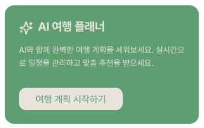
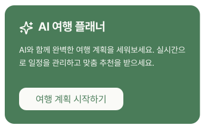

# HomeAIBanner

## 개요

홈 화면 상단 AI 배너 카드 + 퀵메뉴. 여행 계획 시작 유도.

## Variants

| Variant | 설명 |
|---|---|
| Light | 라이트 모드 |
| Dark | 다크 모드 |

## 구성

**배너 (HomeAIBanner):**
- AI 아이콘 + "AI 여행 플래너" 타이틀
- 설명 텍스트
- "여행 계획 시작하기" CTA 버튼 → NewChatScreen 진입

## 스타일

| 속성 | Light | Dark |
|---|---|---|
| 배너 배경 | `Light/Primary,CTA Button` | `Dark/Primary,CTA Button` |
| Border Radius | `radius-lg` | `radius-lg` |
| Elevation | `Light/elevation-2` | `Dark/elevation-2` |
| 타이틀 | `heading-lg` / `Light/Surface,Card BG` | `heading-lg` / `Dark/Title,Body Text` |
| 본문 | `body-md` / `Light/Surface,Card BG` | `body-md` / `Dark/Title,Body Text` |
| CTA 버튼 배경 | `Light/Surface,Card BG` | `Dark/Title,Body Text` |
| CTA 버튼 텍스트 | `body-lg` / `Light/Primary,CTA Button` | `body-lg` / `Dark/Primary,CTA Button` |
| CTA 버튼 Border Radius | `radius-md` | `radius-md` |
| CTA 버튼 Elevation | `Light/elevation-2` | `Dark/elevation-2` |
| 아이콘(ic_ai) 색상 | `Light/Surface,Card BG` | `Dark/Title,Body Text` |

## 관련 아이콘 추가후, 경로 추가
`assets/icons/ic_ai.svg`

## 이미지

### Home AI Banner Dark

### Home AI Banner Light
