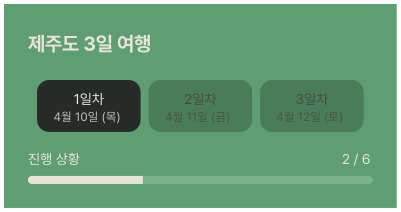
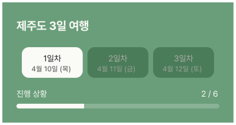

# ItineraryOverviewCard

## 개요

PlanScreen 상단 여행 개요 카드.
여행명, 일차 선택 탭 (날짜 포함), 진행 상황 프로그레스 바로 구성.

> **ItineraryOverviewCard2-BeforeEdit** (PlanDetailScreen 전용) → 별도 컴포넌트 문서 참조.
> **ItineraryOverviewCard2-Editing** (PlanDetailEditScreen 전용) → 별도 컴포넌트 문서 참조.

## Variants

| Variant | 설명 |
|---|---|
| Light | 라이트 모드 |
| Dark | 다크 모드 |

## 구성

```
┌──────────────────────────────────────┐
│  제주도 3일 여행                      │ ← 여행명 heading-lg
│  ┌───────────┐ ┌───────┐ ┌───────┐  │
│  │  1일차    │ │ 2일차 │ │ 3일차 │  │ ← 일차 탭 (가로 스크롤)
│  │ 4월 10일  │ │4월11일│ │4월12일│  │
│  └───────────┘ └───────┘ └───────┘  │
│  진행 상황               2 / 6       │
│  ████████████░░░░░░░░░░░░░░░░        │ ← 프로그레스 바
└──────────────────────────────────────┘
```

## 스타일

| 속성 | Light | Dark |
|---|---|---|
| 배경 | `Light/Primary Light` | `Dark/Primary,CTA Button` |
| Elevation | `Light/elevation-1` | `Dark/elevation-1` |
| 여행명 | `heading-lg` / `Light/Surface,Card BG` | `heading-lg` / `Dark/Title,Body Text` |
| 활성 일차 탭 배경 | `Light/Surface,Card BG` | `Dark/Surface,Card BG` |
| 비활성 일차 탭 배경 | `Light/Primary,CTA Button` | `Dark/Primary Hover,Active` |
| 일차 탭 텍스트 (활성) | `body-md` / `Light/Title,Body Text` | `body-md` / `Dark/Title,Body Text` |
| 일차 탭 텍스트 (비활성) | `body-md` / `Light/Placeholder,Disabled` | `body-md` / `Dark/Placeholder,Disabled` |
| 날짜 텍스트 (활성) | `caption` / `Light/Title,Body Text` | `caption` / `Dark/Title,Body Text` |
| 날짜 텍스트 (비활성) | `caption` / `Light/Placeholder,Disabled` | `caption` / `Dark/Placeholder,Disabled` |
| 일차 탭 Border Radius | `radius-md` | `radius-md` |
| 진행 상황 텍스트 | `body-md` / `Light/Surface,Card BG` | `body-md` / `Dark/Title,Body Text` |
| 프로그레스 바 배경 | `rgba(255,255,255,0.2)` | `rgba(255,255,255,0.2)` |
| 프로그레스 바 채움 | `Light/Surface,Card BG` | `Dark/Title,Body Text` |
| 프로그레스 바 Border Radius | `radius-full` | `radius-full` |

## 동작

- 일차 탭 탭 → 해당 일차 일정으로 스크롤 이동
- 프로그레스 바 → 완료 항목 수 / 전체 항목 수 비율로 자동 계산

## 데이터 구조
일차 탭은 API 응답의 날짜만큼 자동 생성. 하드코딩 금지.

## 이미지

### Itinerary Overview Card Dark


### Itinerary Overview Card Light
