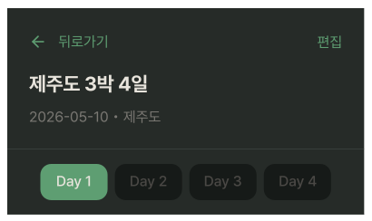
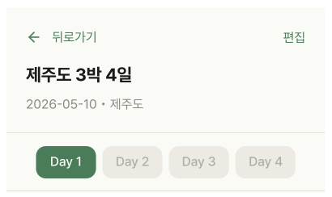
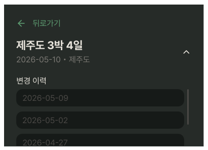
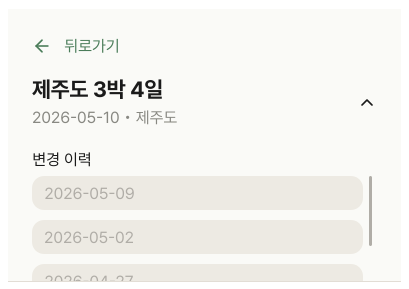

# ItineraryOverviewCard2BeforeEdit

## 개요

PlanDetailScreen 상단 고정 헤더.

← 뒤로가기 / 편집 버튼 + 여행명 + 날짜 + Day 탭으로 구성.

## Variants

| Variant | 설명 |
|---|---|
| Light | 라이트 모드 |
| Dark | 다크 모드 |

## 구성

### 접힌 상태 (기본)
```
┌──────────────────────────────────────┐
│ ← 뒤로가기                      편집 │
│ 제주도 3박 4일                     ∨  │ ← chevron 탭으로 펼침
│ 2026-05-10 • 제주도                  │
├──────────────────────────────────────┤
│ [Day 1]  Day 2   Day 3   Day 4       │ ← Day 탭 (가로 스크롤)
└──────────────────────────────────────┘
```
 
### 펼쳐진 상태 (LogOpen)
```
┌──────────────────────────────────────┐
│ ← 뒤로가기                           │  ← 편집 버튼 숨김
│ 제주도 3박 4일                     ∧  │ ← chevron 탭으로 접힘
│ 2026-05-10 • 제주도                  │
│                                      │
│ 변경 이력                            │ ← 변경 이력 목록 (날짜 리스트)
│ 2026-05-09                           │
│ 2026-05-02                           │
│ 2026-04-27                           │
└──────────────────────────────────────┘
```
> 펼쳐진 상태에서는 **Day 탭 없음** + **편집 버튼 숨김**.

> `isExpanded` state 하나로 접힘/펼침 제어. 별도 컴포넌트로 분리하지 않음.

## 스타일

| 속성 | Light | Dark | 포커스(Light/Dark) |
|---|---|---|---|
| 배경 | `Light/Surface,Card BG` | `Dark/Surface,Card BG` | - |
| 하단 border | `1px solid Light/Divider,Border` | `1px solid Dark/Divider,Border` | - |
| Elevation | `Light/elevation-2` | `Dark/elevation-2` | - |
| 여행명 | `heading-xl` / `Light/Title,Body Text` | `heading-xl` / `Dark/Title,Body Text` | - |
| 날짜/목적지 | `body-lg` / `Light/Caption,Hint` | `body-lg` / `Dark/Caption,Hint` | - |
| 뒤로가기/편집 | `body-lg` / `Light/Primary,CTA Button` | `body-lg` / `Dark/Primary,CTA Button` | - |
| 활성 Day 탭 배경 | `Light/Primary,CTA Button` | `Dark/Primary,CTA Button` | - |
| 비활성 Day 탭 배경 | `Light/Secondary Surface` | `Dark/Secondary Surface` | - |
| 활성 Day 탭 텍스트 | `body-lg` / `Light/Surface,Card BG` | `body-lg` / `Dark/Title,Body Text` | - |
| 비활성 Day 탭 텍스트 | `body-lg` / `Light/Placeholder,Disabled` | `body-lg` / `Dark/Placeholder,Disabled` | - |
| Day 탭 Border Radius | `radius-md` | `radius-md` | - |
| 드롭다운 아이콘(ic_chevron_down) 색상 | `Light/Caption,Hint` | `Dark/Caption,Hint` | `Light/Title,Body Text` / `Dark/Title,Body Text` |

## 스크롤 동작 (Hide on scroll up / Show on scroll down)
 
읽기 전용 화면이라 콘텐츠 영역을 넓게 쓸 수 있도록 스크롤 방향에 따라 헤더 표시/숨김.

## 동작

| 버튼 | 동작 |
|---|---|
| ← 뒤로가기 | PlanListScreen으로 복귀 |
| 편집 | PlanDetailEditScreen 진입 (`isExpanded === false` 일 때만 표시) |
| ∨ / ∧ chevron | 변경 이력 날짜 목록 접힘/펼침 토글. |
| 변경 이력 날짜 탭 | ChangeLogDetailScreen 진입 (해당 날짜 스냅샷 조회) |
| Day N 탭 | 해당 일차 일정으로 스크롤 이동 (`isExpanded === false` 일 때만 표시)  |

## 데이터 구조

Day 탭은 API 응답의 날짜만큼 자동 생성. 하드코딩 금지.

## 관련 아이콘 추가후, 경로 추가
`assets/icons/ic_back.svg`

`assets/icons/ic_chevron_down.svg` → 드롭다운이 열렸을 경우, 반시계 방향으로 180도 회전을 주어서 Up 상태를 만들어 재사용합니다.(+Animation)

## 이미지

### Itinerary Overview Card2 Before Edit Dark


### Itinerary Overview Card2 Before Edit Light


### Itinerary Overview Card2 Before Edit Log Open Dark


### Itinerary Overview Card2 Before Edit Log Open Light


## Props 예시
 
```ts
type ItineraryOverviewCard2BeforeEditProps = {
  title: string;
  date: string;
  location: string;
  days: Day[];
  selectedDay: number;
  onDayPress: (day: number) => void;
  onBack: () => void;
  onEdit?: () => void;              // 없으면 편집 버튼 미표시
  changeLogDate?: string;           // 전달되면 "{날짜} 변경 이력 조회 중" 표시 + 편집 버튼 숨김
};
```
 
| 사용처 | `onEdit` | `changeLogDate` |
|---|---|---|
| `PlanDetailScreen` | O | 없음 |
| `ChangeLogDetailScreen` | 없음 | `"2026-05-09"` |