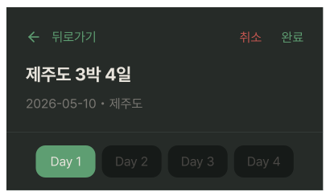
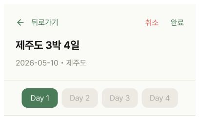

# ItineraryOverviewCard2Editing

## 개요

PlanDetailEditScreen 상단 Sticky 고정 헤더.

BeforeEdit과 구조 동일.

우상단 버튼만 다름 (편집 → 취소 / 완료).

## Variants

| Variant | 설명 |
|---|---|
| Light | 라이트 모드 |
| Dark | 다크 모드 |

## 구성

```
┌─────────────────────────────────────┐
│ ← 뒤로가기             취소    완료  │
│ 제주도 3박 4일                       │ ← heading-xl
│ 2026-05-10 • 제주도                  │ ← body-lg / Caption,Hint
├─────────────────────────────────────┤
│ [Day 1]  Day 2   Day 3   Day 4      │ ← Day 탭 (가로 스크롤)
└─────────────────────────────────────┘
```

## 스타일

BeforeEdit과 동일. 버튼 색상만 다름.

| 속성 | Light | Dark |
|---|---|---|
| 배경 | `Light/Surface,Card BG` | `Dark/Surface,Card BG` |
| 하단 border | `1px solid Light/Divider,Border` | `1px solid Dark/Divider,Border` |
| Elevation | `Light/elevation-2` | `Dark/elevation-2` |
| 여행명 | `heading-xl` / `Light/Title,Body Text` | `heading-xl` / `Dark/Title,Body Text` |
| 날짜/목적지 | `body-lg` / `Light/Caption,Hint` | `body-lg` / `Dark/Caption,Hint` |
| 뒤로가기 / 완료 | `body-lg` / `Light/Primary,CTA Button` | `body-lg` / `Dark/Primary,CTA Button` |
| **취소** | `body-lg` / **`Light/Danger,Logout`** | `body-lg` / **`Dark/Danger,Logout`** |
| 활성 Day 탭 배경 | `Light/Primary,CTA Button` | `Dark/Primary,CTA Button` |
| 비활성 Day 탭 배경 | `Light/Secondary Surface` | `Dark/Secondary Surface` |
| 활성 Day 탭 텍스트 | `body-lg` / `Light/Surface,Card BG` | `body-lg` / `Dark/Title,Body Text` |
| 비활성 Day 탭 텍스트 | `body-lg` / `Light/Placeholder,Disabled` | `body-lg` / `Dark/Placeholder,Disabled` |
| Day 탭 Border Radius | `radius-md` | `radius-md` |

> **BeforeEdit과 차이:** 취소 버튼이 `Danger` 색상 (빨간색). Sticky 고정 (숨김 없음).

## Sticky 처리
 
취소/완료 버튼이 항상 보여야 하므로 스크롤해도 고정.

## 동작

| 버튼 | 동작 |
|---|---|
| ← 뒤로가기 | 편집 취소 → PlanDetailScreen 복귀 |
| 취소 | 변경사항 롤백 → PlanDetailScreen 복귀 |
| 완료 | 변경사항 저장 → PlanDetailScreen 복귀 |
| Day N 탭 | 해당 일차 편집 목록으로 스크롤 이동 |

## 데이터 구조

Day 탭은 날짜만큼 자동 생성. 하드코딩 금지.

## 관련 아이콘 추가후, 경로 추가
`assets/icons/ic_back.svg`

## 이미지

### Itinerary Overview Card2 Editing Dark


### Itinerary Overview Card2 Editing Light
