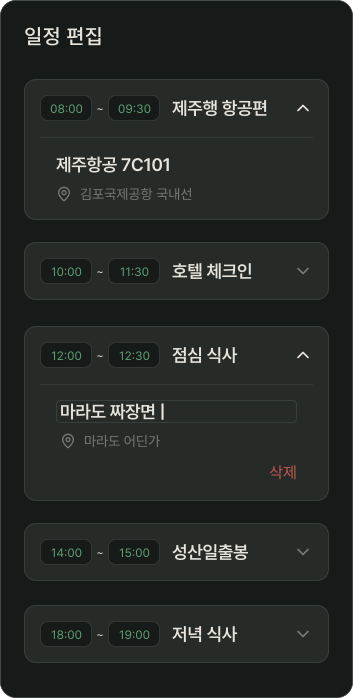
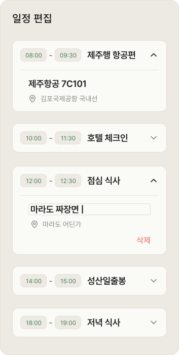

# PlanDetailEditItem

## 개요

PlanDetailEditScreen 인라인 편집 아코디언 카드 하나.

닫힌 상태에서는 시간 + 장소명만 표시, ∨ 탭하면 펼쳐져 편집 가능.

## Variants

| Variant | 설명 |
|---|---|
| Light | 라이트 모드 |
| Dark | 다크 모드 |

## 구성

### 닫힌 상태
```
┌──────────────────────────────────────┐
│ [08:00] ~ [09:30]  제주행 항공편   ∨ │ 시간, 일정명 ic_chevron_down
└──────────────────────────────────────┘
```
- ∨ 버튼만 탭 가능 → 펼쳐짐
- 시간/장소명은 닫힌 상태에서 읽기 전용

### 펼쳐진 상태 (포커스)
```
┌──────────────────────────────────────┐
│ [08:00] ~ [09:30]  제주행 항공편   ∧ │  (읽기 전용) 시간, 일정명 ic_chevron_down
│ 제주항공 7C101                       │  (읽기 전용) 메모
│ 📍 김포국제공항 국내선                │  (읽기 전용) 위치 ic_pin
│                                      │
└──────────────────────────────────────┘
```

```
┌──────────────────────────────────────┐
│ [12:00] ~ [12:30]  점심 식사        ∧ │  ← 시간, 일정명 편집 가능 ic_chevron_down
│ 마라도 짜장면 |                        │  ← 메모 편집 가능
│ 📍 김포국제공항 국내선                │   ← 위치 편집 가능 ic_pin
│                               삭제    │  ← Danger 색상
└──────────────────────────────────────┘
```

## 카드 스타일

| 속성 | Light | Dark | 포커스(Light/Dark) |
|---|---|---|---|
| 배경 | `Light/Surface,Card BG` | `Dark/Surface,Card BG` | - |
| Border | `1px solid Light/Divider,Border` | `1px solid Dark/Primary,CTA Button` | - |
| Border Radius | `radius-md` | `radius-md` | - |
| Elevation | `Light/elevation-1` | `Dark/elevation-1` | `Light/elevation-2` / `Dark/elevation-2` |
| 시간 텍스트 | `caption` / `Light/Primary,CTA Button` | `caption` / `Dark/Primary,CTA Button` | - |
| 시간 배경 | `Light/Secondary Surface` | `Dark/Secondary Surface` | - |
| 시간 Border | `1px solid Light/Divider,Border` | `1px solid Dark/Primary,CTA Button` | - |
| 시간 Border Radius | `radius-sm` | `radius-sm` | - |
| 일정명, 메모 텍스트 | `heading-md` / `Light/Title,Body Text` | `heading-md` / `Dark/Title,Body Text` | - |
| 위치 텍스트 | `body-md` / `Light/Caption,Hint` | `body-md` / `Dark/Caption,Hint` | - |
| 위치 아이콘(ic_pin) 색상 | `Light/Caption,Hint` | `Dark/Caption,Hint` | - |
| 삭제 | `body-lg` / `Light/Danger,Logout` | `body-lg` / `Dark/Danger,Logout` | - |
| 드롭다운 아이콘(ic_chevron_down) 색상 | `Light/Caption,Hint` | `Dark/Caption,Hint` | `Light/Title,Body Text` / `Dark/Title,Body Text` |

## 편집 가능 / 읽기 전용 필드

| 필드 | 편집 가능 여부 |
|---|---|
| 시작/종료 시간 | ✅ 탭 시 숫자 키패드, `HH:MM` 포맷 |
| 일정명/메모 | ✅ TextInput 활성 |
| 예약 관련(항공편명, 공항, 예약링크, 금액) | ❌ 읽기 전용 — 수정이 필요하면 채팅에서 AI한테 요청 |

편집 시 텍스트 포커스
- **Border Radius:** `radius-xs`
- **Border:**
    - Light: `1px solid Light/Divider,Border`
    - Dark: `1px solid Dark/Divider,Border`

## Validation
 
| 항목 | 조건 | 실패 시 |
|---|---|---|
| 시간 포맷 | `HH:MM` 정규식 검사 | 원래 값으로 롤백 + 에러 토스트 |
| 논리적 시간 | 시작 시간 < 종료 시간 | 에러 토스트("종료 시간은 시작 시간 이후여야 합니다.") |
| 일정명 빈 값 | 최소 1자 이상 | 에러 토스트 ("일정명을 입력해주세요.") |
| 시간 겹침 | 현재 수정 중인 일정이 다른 일정과 겹치는지 검사 | 에러 토스트 ("시간이 겹칩니다.") |
 
## 서버 전송 전략
 
- **로컬 업데이트:** 모든 편집은 `onSave`를 통해 Screen 로컬 상태에만 즉시 반영
- **최종 전송:** "완료" 버튼 탭 시 전체 배열을 한번에 서버 PATCH
- **백엔드 검증:** 서버에서 시간 겹침 및 일정 정합성 최종 확인 → 실패 시 에러 응답 → 프론트 에러 핸들링
## 동작
 
- ∨ 탭 → 펼쳐짐 (ic_chevron_down 180도 회전 애니메이션)
- 포커스 해제(`onBlur`) → `onSave` prop 호출 → Screen 로컬 상태 업데이트
- 시간 변경 시 → Screen 로컬 상태에서 배열 sort
- "삭제" 탭 → `onDelete` prop 호출 → Screen 로컬 상태에서 제거


## 구현 주의사항

- `KeyboardAvoidingView` 필수 — 키보드 올라올 때 편집 항목 가려지지 않게

## 관련 아이콘 추가후, 경로 추가
`assets/icons/ic_pin.svg`

`assets/icons/ic_chevron_down.svg` → 드롭다운이 열렸을 경우, 반시계 방향으로 180도 회전을 주어서 Up 상태를 만들어 재사용합니다.(+Animation)

## 이미지

### Plan Detail Edit Dark


### Plan Detail Edit Light

