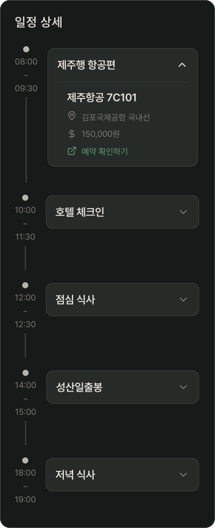
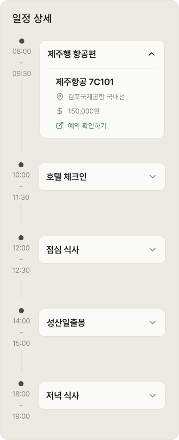

# PlanDetailItem

## 개요

PlanDetailScreen 타임라인 아코디언 카드 하나.

닫힌 상태에서는 장소명만 표시, 탭하면 펼쳐져 상세 정보 표시.

## Variants

| Variant | 설명 |
|---|---|
| Light | 라이트 모드 |
| Dark | 다크 모드 |

## 구성

### 닫힌 상태
```
  ●     ┌──────────────────────────┐
HH:MM   │ 제주행 항공편          ∨  │ 일정명
  ~     └──────────────────────────┘
HH:MM
  │ (세로선)
```

### 펼쳐진 상태 (포커스)
```
  ●     ┌──────────────────────────┐
HH:MM   │ 제주행 항공편          ∧  │ 일정명
  ~     │ 제주항공 7C101            │ detail.airline + detail.flight_no
HH:MM   │ 📍 김포국제공항 국내선     │ 위치 ic_pin
  │     │ 💲 150,000원            │ 가격 ic_price
  │     │ 🔗 예약 확인하기          │ 외부 링크 ic_external_link
  │     └──────────────────────────┘
  │          
  │ (세로선)
  ●     ┌──────────────────────────┐
HH:MM   │ 점심 식사              ∧  │ 일정명
  ~     │ 마라도 짜장면              │ 메모
HH:MM   │ 📍 마라도 어딘가         │ 위치 ic_pin
  │     │ 💲 15,000원            │ 가격 ic_price
  │     └──────────────────────────┘
  │          
  │ (세로선)
```

## 타임라인 구조

| 요소 | 스타일 |
|---|---|
| 도트 | 10px 원형 / `Light/Sub-heading` | `Dark/Sub-heading` |
| 세로 연결선 | 2px / `Light/Divider,Border` | `Dark/Divider,Border` |
| 시간 | `body-md` / `Light/Caption,Hint` | `Dark/Caption,Hint` |

## 카드 스타일

| 속성 | Light | Dark | 포커스(Light/Dark) |
|---|---|---|---|
| 배경 | `Light/Surface,Card BG` | `Dark/Surface,Card BG` | - |
| Border | `1px solid Light/Divider,Border` | `1px solid Dark/Divider,Border` | - |
| Border Radius | `radius-md` | `radius-md` | - |
| Elevation | `Light/elevation-1` | `Dark/elevation-1` | `Light/elevation-2` / `Dark/elevation-2` |
| 일정명, 메모 텍스트 | `heading-md` / `Light/Title,Body Text` | `heading-md` / `Dark/Title,Body Text` | - |
| 위치 텍스트 | `body-md` / `Light/Caption,Hint` | `body-md` / `Dark/Caption,Hint` | - |
| 위치, 돈 아이콘(ic_pin, ic_price) 색상 | `Light/Caption,Hint` | `Dark/Caption,Hint` | - |
| 외부 링크 아이콘(ic_external_link) 색상 | `Light/Primary,CTA Button` | `Dark/Primary,CTA Button` | - |
| 드롭다운 아이콘(ic_chevron_down) 색상 | `Light/Caption,Hint` | `Dark/Caption,Hint` | `Light/Title,Body Text` / `Dark/Title,Body Text` |

## 관련 아이콘 추가후, 경로 추가
`assets/icons/ic_pin.svg`
`assets/icons/ic_price.svg`
`assets/icons/ic_external_link.svg`
`assets/icons/ic_chevron_down.svg` → 드롭다운이 열렸을 경우, 반시계 방향으로 180도 회전을 주어서 Up 상태를 만들어 재사용합니다.(+Animation)

## 이미지

### Plan Detail Edit Dark


### Plan Detail Edit Light

