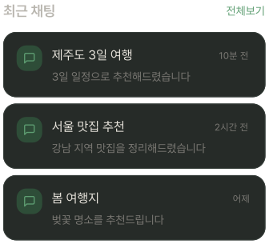
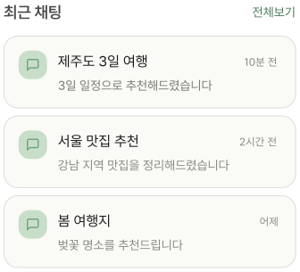

# RecentChatSection

## 개요

홈 화면 최근 채팅 섹션. 최대 3개 표시.
없으면 카드 표시 X, 섹션은 살려둠.

## Variants

| Variant | 설명 |
|---|---|
| Light | 라이트 모드 |
| Dark | 다크 모드 |

## 구성

```
최근 채팅                    전체보기
┌──────────────────────────────────┐
│ [✦]  채팅명           10분 전   │ ← elevation-1
│       마지막 메시지 미리보기      │
└──────────────────────────────────┘
```

## 스타일

| 속성 | Light | Dark |
|---|---|---|
| 카드 배경 | `Light/Surface,Card BG` | `Dark/Surface,Card BG` |
| 카드 border | `1px solid Light/Divider,Border` | `1px solid Dark/Divider,Border` |
| 카드 Border Radius | `radius-lg` | `radius-lg` |
| 카드 Elevation | `Light/elevation-1` | `Dark/elevation-1` |
| 채팅 아이콘 배경 | `Light/Primary Tint,Tag BG` | `Dark/Primary Tint,Tag BG` |
| 채팅 아이콘 Border Radius | `radius-md` | `radius-md` |
| 섹션 헤더 | `heading-md` / `Light/Sub-heading` | `heading-md` / `Dark/Sub-heading` |
| 채팅방명 | `body-lg` / `Light/Title,Body Text` | `body-lg` / `Dark/Title,Body Text` |
| 메시지 미리보기(aiSummary) | `body-md` / `Light/Caption,Hint` | `body-md` / `Dark/Caption,Hint` |
| 시간 | `caption` / `Light/Caption,Hint` | `caption` / `Dark/Caption,Hint` |
| 전체보기 | `body-md` / `Light/Primary,CTA Button` | `body-md` / `Dark/Primary,CTA Button` |
| 아이콘 색상 | `Light/Primary Light` | `Dark/Primary,CTA Button` |
| 아이콘 컨테이너 배경 | `Light/Primary Tint,Tag BG` | `Dark/Primary Tint,Tag BG` |
| 아이콘 컨테이너 Border Radius | `radius-md` | `radius-md` |

## 동작

| 버튼 | 동작 |
|---|---|
| 각 카드 | 해당 채팅방 진입 |
| 전체 보기 | NavigationDrawer |

## 관련 아이콘 추가후, 경로 추가
`assets/icons/ic_chat.svg`

## 이미지

### Recent Chat Section Dark


### Recent Chat Section Light
