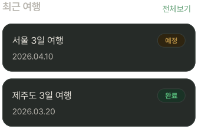
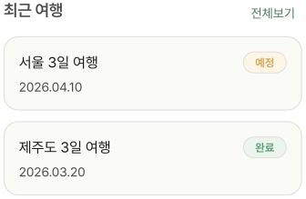

# RecentTravelSection

## 개요

홈 화면 최근 여행 섹션. 최대 3개 표시.
없으면 카드 표시 X, 섹션은 살려둠.
예정/완료는 StatusBadge

## Variants

| Variant | 설명 |
|---|---|
| Light | 라이트 모드 |
| Dark | 다크 모드 |

## 구성

```
최근 여행                    전체보기
┌──────────────────────────────────┐
│  여행명               [예정]     │ ← elevation-1
│  날짜                            │
└──────────────────────────────────┘
┌──────────────────────────────────┐
│  여행명               [완료]     │ ← elevation-1
│  날짜                            │
└──────────────────────────────────┘
```
> 예정/완료 ScheduleStatusBadge

## 스타일

| 속성 | Light | Dark |
|---|---|---|
| 카드 배경 | `Light/Surface,Card BG` | `Dark/Surface,Card BG` |
| 카드 border | `1px solid Light/Divider,Border` | `1px solid Dark/Divider,Border` |
| 카드 Border Radius | `radius-lg` | `radius-lg` |
| 카드 Elevation | `Light/elevation-1` | `Dark/elevation-1` |
| 섹션 헤더 | `heading-md` / `Light/Sub-heading` | `heading-md` / `Dark/Sub-heading` |
| 여행명 | `body-lg` / `Light/Title,Body Text` | `body-lg` / `Dark/Title,Body Text` |
| 날짜 | `body-md` / `Light/Sub-heading` | `body-md` / `Dark/Sub-heading` |
| 전체보기 | `body-md` / `Light/Primary,CTA Button` | `body-md` / `Dark/Primary,CTA Button` |

## 동작

| 버튼 | 동작 |
|---|---|
| 각 카드 | PlanListDetailScreen 진입 |
| 전체 보기 | PlanListScreen 진입 |

## 이미지

### Recent Chat Section Dark


### Recent Chat Section Light
