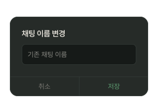
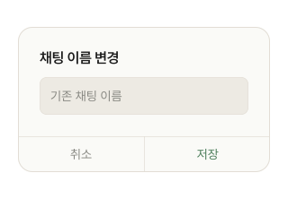

# RenameChatModal

## 개요

채팅 이름 변경 모달.

ChatHeader Active 케밥(⋯) → OverflowMenu → "채팅방 이름 변경" 탭 시 오픈.

NavigationDrawer 채팅 항목 케밥(⋯) → OverflowMenu → "채팅방 이름 변경" 탭 시에도 오픈.

## Variants

| Variant | 설명 |
|---|---|
| Light | 라이트 모드 |
| Dark | 다크 모드 |

## 구성

```
┌──────────────────────────┐
│  채팅 이름 변경           │
│  ┌────────────────────┐  │
│  │  기존 채팅 이름     │  │ ← TextInput (prefill)
│  └────────────────────┘  │
├────────────┬─────────────┤
│    취소    │    저장     │
└────────────┴─────────────┘
```

## 스타일

| 속성 | Light | Dark |
|---|---|---|
| 너비 | 280px | 280px |
| 배경 | `Light/Surface,Card BG` | `Dark/Surface,Card BG` |
| Border Radius | `radius-lg` | `radius-lg` |
| Elevation | `Light/elevation-4` | `Dark/elevation-4` |
| Scrim | `scrim-modal` | `scrim-modal` |
| 제목 | `heading-sm` / `Light/Title,Body Text` | `heading-sm` / `Dark/Title,Body Text` |
| 입력창 배경 | `Light/Secondary Surface` | `Dark/Secondary Surface` |
| 입력창 Border Radius | `radius-sm` | `radius-sm` |
| 취소 | `body-md` / `Light/Caption,Hint` | `body-md` / `Dark/Caption,Hint` |
| 저장 | `body-md` / `Light/Primary,CTA Button` | `body-md` / `Dark/Primary,CTA Button` |

## 동작

1. 기존 채팅 이름 prefill
2. 수정 후 "저장" → 변경 있으면 PATCH API → 모달 닫기
3. "취소" → 변경 없이 닫기
4. API 실패 → 에러 토스트 + 모달 유지

## 이미지

### Rename Chat Modal Dark


### Rename Chat Modal Light
