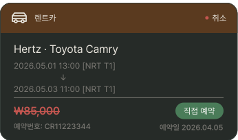
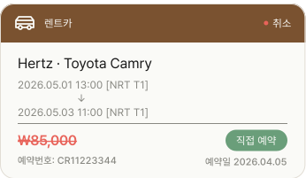

# CarReservationCard

## 개요

렌트카 예약 카드. PlanListScreen 예약 탭에서 사용.

## 구성

```
┌─────────────────────────────────────┐
│ 🚗 렌트카                      ● 취소 │ ← 갈색 헤더 + ReservationStatusBadge
├─────────────────────────────────────┤
│  Hertz · Toyota Camry               │
│  2026.05.01 13:00 [NRT T1]          │
│             ↓                       │
│  2026.05.03 11:00 [NRT T1]          │
│  ─────────────────────────────────  │
│  ₩85,000            직접 예약        │ ← 예약 취소 시 취소선. + BookedByBadge
│  예약번호: CR11223344   예약일 2026.04.05 │
└─────────────────────────────────────┘
```

## 스타일
- **FontFamily:** `Pretendard-Bold` 로 덮어씌우기

| 속성 | Light | Dark |
|---|---|---|
| 카드 배경 | `Light/Surface,Card BG` | `Dark/Surface,Card BG` |
| 카드 border | `1px solid Light/Divider,Border` | `1px solid Dark/Divider,Border` |
| Border Radius | `radius-lg` | `radius-lg` |
| Elevation | `Light/elevation-1` | `Dark/elevation-1` |
| 헤더 배경 | `Light/Car Rental Header` | `Dark/Car Rental Header` |
| 헤더 텍스트 | 렌트카 / `caption` / `Light/Surface,Card BG` / `Pretendard-Bold` 로 덮어씌우기 | 렌트카 / `caption` / `Dark/Title,Body Text` / `Pretendard-Bold` 로 덮어씌우기 |
| 차량명 | `body-lg` / `Light/Title,Body Text` | `body-lg` / `Dark/Title,Body Text` |
| 픽업/반납 | `caption` / `Light/Caption,Hint` | `caption` / `Dark/Caption,Hint` |
| 금액 (취소) | `heading-sm` / `Light/Danger,Logout` | `heading-sm` / `Dark/Danger,Logout` |
| 금액 (정상) | `heading-sm` / `Light/Primary,CTA Button` | `heading-sm` / `Dark/Primary,CTA Button` |
| 예약번호 | `label` / `Light/Caption,Hint` | `label` / `Dark/Caption,Hint` |
| 예약일 | `label` / `Light/Caption,Hint` | `label` / `Dark/Caption,Hint` |
| 아이콘 색상 | `Light/Surface,Card BG` | `Dark/Title,Body Text` |

> 취소 상태일 때 금액 색상이 `Danger` 색상으로 변경됨. 취소선도 적용.

## 관련 아이콘 추가후, 경로 추가
`assets/icons/ic_rental_car.svg`

## 이미지

### Car Reservation Card Dark


### Car Reservation Card Light

