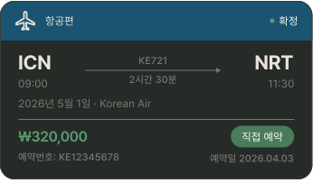
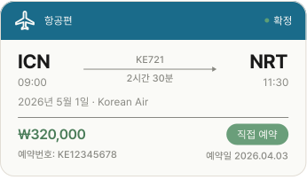

# FlightReservationCard

## 개요

항공편 예약 카드. PlanListScreen 예약 탭에서 사용.

## 구성

```
┌─────────────────────────────────────┐
│ ✈ 항공편                      ● 확정 │ ← 파란 헤더 + ReservationStatusBadge
├─────────────────────────────────────┤
│  ICN  ───KE721── ▶ ──2시간30분──  NRT │
│  09:00                        11:30 │
│  2026년 5월 1일 · Korean Air         │
│  ─────────────────────────────────  │
│  ₩320,000          직접 예약         │
│  예약번호: KE12345678   예약일 2026.04.03 │
└─────────────────────────────────────┘
```

## 스타일

| 속성 | Light | Dark |
|---|---|---|
| 카드 배경 | `Light/Surface,Card BG` | `Dark/Surface,Card BG` |
| 카드 border | `1px solid Light/Divider,Border` | `1px solid Dark/Divider,Border` |
| Border Radius | `radius-lg` | `radius-lg` |
| Elevation | `Light/elevation-1` | `Dark/elevation-1` |
| 헤더 배경 | `Light/Flight Header` | `Dark/Flight Header` |
| 헤더 텍스트 | 항공편 / `caption` / `Light/Surface,Card BG` / `Pretendard-Bold` 로 덮어씌우기 | 항공편 / `caption` / `Dark/Title,Body Text` / `Pretendard-Bold` 로 덮어씌우기 |
| 출발/도착 코드 | `heading-xl` / `Light/Title,Body Text` | `heading-xl` / `Dark/Title,Body Text` |
| 항공편명/소요시간 | `label` / `Light/Caption,Hint` | `label` / `Dark/Caption,Hint` |
| 날짜/항공사 | `caption` / `Light/Caption,Hint` | `caption` / `Dark/Caption,Hint` |
| 금액 (취소) | `heading-sm` / `Light/Danger,Logout` | `heading-sm` / `Dark/Danger,Logout` |
| 금액 (정상) | `heading-sm` / `Light/Primary,CTA Button` | `heading-sm` / `Dark/Primary,CTA Button` |
| 예약번호 | `label` / `Light/Caption,Hint` | `label` / `Dark/Caption,Hint` |
| 예약일 | `label` / `Light/Caption,Hint` | `label` / `Dark/Caption,Hint` |
| 아이콘 색상 | `Light/Surface,Card BG` | `Dark/Title,Body Text` |

## 관련 아이콘 추가후, 경로 추가
`assets/icons/ic_airplane.svg`

## 이미지

### Flight Reservation Card Dark


### Flight Reservation Card Light

