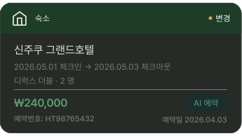
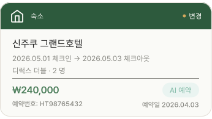

# LodgingReservationCard

## 개요

숙소 예약 카드. PlanListScreen 예약 탭에서 사용.

## 구성

```
┌─────────────────────────────────────┐
│ 🏠 숙소                        ● 변경 │ ← 초록 헤더 + ReservationStatusBadge
├─────────────────────────────────────┤
│  신주쿠 그랜드호텔                    │
│  2026.05.01 체크인 → 2026.05.03 체크아웃 │
│  디럭스 더블 · 2 명                   │
│  ─────────────────────────────────  │
│  ₩240,000            AI 예약         │
│  예약번호: HT98765432   예약일 2026.04.03 │
└─────────────────────────────────────┘
```

## 스타일

| 속성 | Light | Dark |
|---|---|---|
| 카드 배경 | `Light/Surface,Card BG` | `Dark/Surface,Card BG` |
| Border Radius | `radius-lg` | `radius-lg` |
| Elevation | `Light/elevation-1` | `Dark/elevation-1` |
| 헤더 배경 | `Light/Accommodation Header` | `Dark/Accommodation Header` |
| 헤더 텍스트 | 숙소 / `caption` / `Light/Surface,Card BG` / `Pretendard-Bold` 로 덮어씌우기 | 숙소 / `caption` / `Dark/Title,Body Text` / `Pretendard-Bold` 로 덮어씌우기 |
| 숙소명 | `body-lg` / `Light/Title,Body Text` | `body-lg` / `Dark/Title,Body Text` |
| 날짜/인원 | `caption` / `Light/Caption,Hint` | `caption` / `Dark/Caption,Hint` |
| 금액 (취소) | `heading-sm` / `Light/Danger,Logout` | `heading-sm` / `Dark/Danger,Logout` |
| 금액 (정상) | `heading-sm` / `Light/Primary,CTA Button` | `heading-sm` / `Dark/Primary,CTA Button` |
| 예약번호 | `label` / `Light/Caption,Hint` | `label` / `Dark/Caption,Hint` |
| 예약일 | `label` / `Light/Caption,Hint` | `label` / `Dark/Caption,Hint` |
| 아이콘 색상 | `Light/Surface,Card BG` | `Dark/Title,Body Text` |

## 관련 아이콘 추가후, 경로 추가
`assets/icons/ic_lodging.svg`

## 이미지

### Lodging Reservation Card Dark


### Lodging Reservation Card Light
