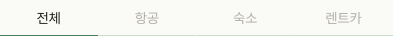

# ReservationTypeTab

## 개요

PlanListScreen 예약 탭에서 표시되는 예약 타입 필터.
전체 / 항공 / 숙소 / 렌트카 중 하나를 선택.

## Variants

| Variant | 설명 |
|---|---|
| Light | 라이트 모드 |
| Dark | 다크 모드 |

## 구성

```
┌──────┬──────┬──────┬──────┐
│ 전체  │ 항공 │ 숙소 │ 렌트카│  ← 하단 border로 활성 표시
└──────┴──────┴──────┴──────┘
```

## 스타일

| 속성 | Light | Dark |
|---|---|---|
| 배경 | `Light/Surface,Card BG` | `Dark/Surface,Card BG` |
| 활성 탭 하단 border | `Light/Primary,CTA Button` | `Dark/Primary,CTA Button` |
| 비활성 탭 하단 border | `Light/Primary Tint,Tag BG` | `Dark/Primary Tint,Tag BG` |
| 활성 텍스트 | `body-md` / **FontFamily:** `Pretendard-Bold` 로 덮어씌우기 / `Light/Title,Body Text` | `body-md` / **FontFamily:** `Pretendard-Bold` 로 덮어씌우기 / `Dark/Title,Body Text` |
| 비활성 텍스트 | `body-md` / `Light/Placeholder,Disabled` | `body-md` / `Dark/Placeholder,Disabled` |

## 이미지

### Reservation Type Tab Dark


### Reservation Type Tab Light

