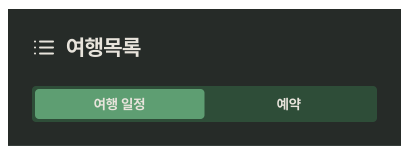
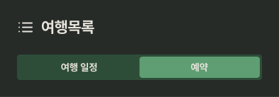
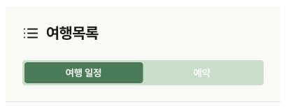
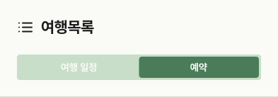

# TravelListTabBar

## 개요

PlanListScreen 상단 헤더 영역.

"여행목록" 타이틀 + 여행 일정 / 예약 탭 전환 세그먼트.

## Variants

| Variant | 설명 |
|---|---|
| Light / 일정 탭 | 라이트, 여행 일정 선택 |
| Light / 예약 탭 | 라이트, 예약 선택 |
| Dark / 일정 탭 | 다크, 여행 일정 선택 |
| Dark / 예약 탭 | 다크, 예약 선택 |

## 구성

```
┌──────────────────────────────┐
│ [iii] 여행목록                   │ ← 타이틀
│ ┌──────────────┬──────────┐  │
│ │  여행 일정   │   예약   │  │ ← 세그먼트 탭
│ └──────────────┴──────────┘  │
└──────────────────────────────┘
```

## 스타일

| 속성 | Light | Dark |
|---|---|---|
| 배경 | `Light/Surface,Card BG` | `Dark/Surface,Card BG` |
| 하단 border | `1px solid Light/Divider,Border` | `1px solid Dark/Divider,Border` |
| Elevation('여행 일정' 세그먼트 일 때만 적용) | `Light/elevation-2` | `Dark/elevation-2` |
| 타이틀 | `heading-xl` / `Light/Title,Body Text` | `heading-xl` / `Dark/Title,Body Text` |
| 세그먼트 배경 | `Light/Primary Tint,Tag BG` | `Dark/Primary Tint,Tag BG` |
| 활성 탭 배경 | `Light/Primary,CTA Button` | `Dark/Primary,CTA Button` |
| 탭 텍스트 | `body-md` / **FontFamily:** `Pretendard-Bold` 로 덮어씌우기 / `Light/Surface,Card BG` | `body-md` / **FontFamily:** `Pretendard-Bold` 로 덮어씌우기 / `Dark/Title,Body Text` |
| 세그먼트 Border Radius | `radius-xs` | `radius-xs` |
| 아이콘 색상 | `Light/Title,Body Text` | `Dark/Title,Body Text` |

## 동작

| 탭 | 동작 |
|---|---|
| 여행 일정 | MyTravelPlanList(TravelPlanCard 조합) 표시 |
| 예약 | ReservationTypeTab + ReservationStatusFilter + MyReservationList(ReservationCard 조합) 표시 |

## 관련 아이콘 추가후, 경로 추가
`assets/icons/ic_plan_list.svg`

## 이미지

### Travel List Tab Bar Dark



### Travel List Tab Bar Light

