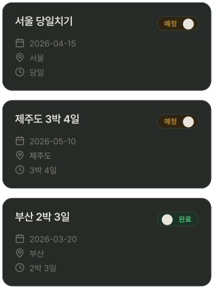
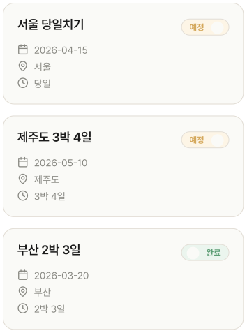

# TravelPlanCard

## 개요

MyTravelPlanList의 개별 여행 카드. 

PlanListScreen 여행 일정 탭에서 배열을 map으로 렌더링.

## 구성

```
┌────────────────────────────────────┐
│  제주도 3박 4일        [예정/완료]  │ ← StatusToggle
│  📅 2026.04.10                    │
│  🚩 제주도                         │
│  🕛 3박 4일                        │
└────────────────────────────────────┘
```

## 스타일

| 속성 | Light | Dark |
|---|---|---|
| 카드 배경 | `Light/Surface,Card BG` | `Dark/Surface,Card BG` |
| 카드 border | `1px solid Light/Divider,Border` | `1px solid Dark/Divider,Border` |
| Border Radius | `radius-lg` | `radius-lg`  |
| Elevation | `Light/elevation-1` | `Dark/elevation-1` |
| 여행명 | `heading-md` / `Light/Title,Body Text` | `heading-md` / `Dark/Title,Body Text` |
| 날짜 | `body-md` / `Light/Caption,Hint` | `body-md` / `Dark/Caption,Hint` |

## 동작

- 카드 탭 → PlanDetailScreen 진입
- StatusToggle 탭 → 상태 변경

## 관련 아이콘 추가후, 경로 추가
`assets/icons/ic_plan.svg`

`assets/icons/ic_pin.svg`

`assets/icons/ic_clock.svg`

## 이미지

### My Travel Plan List Dark


### My Travel Plan List Light
