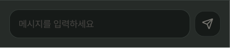
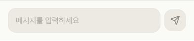
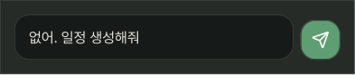
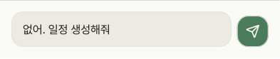

# TypeMessageWindow

## 개요

채팅 하단 메시지 입력창.

입력값 유무에 따라 전송 버튼이 자동으로 활성/비활성 처리됨.

Figma에서는 `FALSE`(입력 없음) / `TRUE`(입력 있음) 두 Variant로 표현되어 있으나 코드에서는 하나의 컴포넌트로 구현하고 내부 상태로 처리.

## Variants (Figma 기준)

| Variant | 설명 |
|---|---|
| FALSE / Light | 입력 없음 → 전송 버튼 비활성 |
| FALSE / Dark | 입력 없음 → 전송 버튼 비활성 |
| TRUE / Light | 입력 있음 → 전송 버튼 활성 |
| TRUE / Dark | 입력 있음 → 전송 버튼 활성 |

## 스타일

| 속성 | Light | Dark |
|---|---|---|
| 높이 | 82px | 82px |
| 배경 | `Light/Surface,Card BG` | `Dark/Surface,Card BG` |
| 상단 border | `1px solid Light/Divider,Border` | `1px solid Dark/Divider,Border` |
| 입력창 배경 | `Light/Secondary Surface` | `Dark/Secondary Surface` |
| 입력창 Border Radius | `radius-lg` | `radius-lg` |
| Placeholder | `body-lg` / `Light/Placeholder,Disabled` | `body-lg` / `Dark/Placeholder,Disabled` |
| 입력 텍스트 | `body-lg` / `Light/Title,Body Text` | `body-lg` / `Dark/Title,Body Text` |

### 전송 버튼 (ChatSendButton)

| 속성 | 활성 (입력 있음) | 비활성 (입력 없음) |
|---|---|---|
| 배경 (Light) | `Light/Primary,CTA Button` | `Light/Secondary Surface` |
| 배경 (Dark) | `Dark/Primary,CTA Button` | `Dark/Secondary Surface` |
| Elevation | `Light/elevation-2` / `Dark/elevation-2` | 없음 |

## Validation
 trim 후, 길이 > 0 이면, `ChatSendButton` 활성화.

## 이미지

### Type Message Window FALSE Dark/Light

### Type Message Window TRUE Dark/Light

