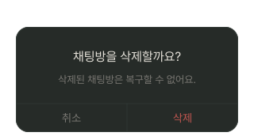
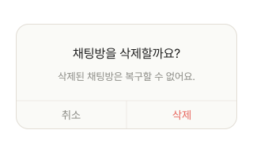
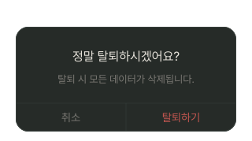
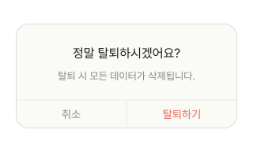
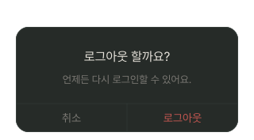
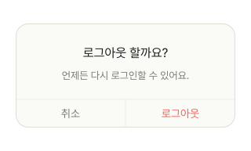

# Alert

## 개요

사용자 확인이 필요한 액션 다이얼로그. 취소 / 확인 버튼.

## Variants

| Variant | 설명 |
|---|---|
| ChatDeleteAlert / Light | 채팅 삭제 확인 |
| ChatDeleteAlert / Dark | 채팅 삭제 확인 |
| LogoutAlert / Light | 로그아웃 확인 |
| LogoutAlert / Dark | 로그아웃 확인 |
| DeleteAccountAlert / Light | 회원탈퇴 확인 |
| DeleteAccountAlert / Dark | 회원탈퇴 확인 |

## 스타일

### Light Mode

- **너비:** 280px
- **Border Radius:** `radius-lg`
- **Elevation:** `light/elevation-4`
- **Scrim:** `scrim-modal` (`rgba(30,40,34,0.48)`)
- **Typography (제목):** `body-lg`
- **Typography (본문):** `body-sm`
- **확인(삭제/로그아웃/탈퇴하기) 버튼 색상:** `light/Danger,Logout`
- **취소 버튼 색상:** `light/Caption,Hint`
- **확인(삭제/로그아웃/탈퇴하기), 취소 버튼:** `body-md`
- **버튼 영역 구분:**
  - **버튼 영역 상단**: `1px solid light/Divider,Border`
  - **확인 버튼 왼쪽**: `1px solid light/Divider,Border`

### Dark Mode

- **너비:** 280px
- **Border Radius:** `radius-lg`
- **Elevation:** `dark/elevation-4`
- **Scrim:** `scrim-modal`
- **Typography (제목):** `body-lg`
- **Typography (본문):** `body-sm`
- **확인(삭제/로그아웃/탈퇴하기) 버튼 색상:** `dark/Danger,Logout`
- **취소 버튼 색상:** `dark/Caption,Hint`
- **확인(삭제/로그아웃/탈퇴하기), 취소 버튼:** `body-md`
- **버튼 영역 구분:**
  - **버튼 영역 상단**: `1px solid dark/Divider,Border`
  - **확인 버튼 왼쪽**: `1px solid dark/Divider,Border`

## 이미지

### Chat Delete Dark/Light

### DeleteAccountAlert Dark/Light

### LogoutAlert Dark/Light

