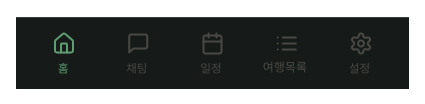
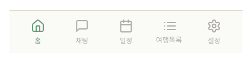

# BottomNavigation

## 개요

전체 화면 하단 고정 탭 바. 모든 화면에서 항상 표시.

## 탭 구성

| 탭 | 라벨 | 활성 화면 |
|---|---|---|
| Home | 홈 | HomeScreen |
| Chat | 채팅 | ChatScreen |
| Plan | 일정 | PlanScreen |
| PlanList | 여행목록 | PlanListScreen |
| Setting | 설정 | SettingScreen |

## 스타일

### Light Mode
- **높이:** 72px + `insets.bottom` (기기 안전영역 포함)
- **Elevation:** `Light/elevation-3`
- **Typography:** `label`
- **활성 색상:** `Light/Primary,CTA Button`
- **비활성 색상:** `Light/Placeholder,Disabled`
- **배경:** `Light/Surface,Card BG`
- **상단 border:** `1px solid Light/Divider,Border`

### Dark Mode
- **높이:** 72px + `insets.bottom` (기기 안전영역 포함)
- **Elevation:** `Dark/elevation-3`
- **Typography:** `label`
- **활성 색상:** `Dark/Primary,CTA Button`
- **비활성 색상:** `Dark/Placeholder,Disabled`
- **배경:** `Dark/Surface,Card BG`
- **상단 border:** `1px solid Dark/Divider,Border`

## 동작

- 항상 화면 하단 고정
- 활성 탭 라벨 색상 강조

## 구현 주의사항 — SafeArea

기기마다 홈바/제스처바 높이가 달라서 `useSafeAreaInsets()`로 처리해야 함. RN 구현 패턴은 `docs/conventions.md`의 SafeArea 섹션 참조.

## 관련 아이콘 추가후, 경로 추가
`assets/icons/ic_home_label.svg`

`assets/icons/ic_chat_label.svg`

`assets/icons/ic_plan_label.svg`

`assets/icons/ic_plan_list_label.svg`

`assets/icons/ic_setting_label.svg`

## 이미지

### BottomNavigation Dark

### BottomNavigation Light
