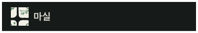
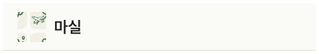

# Header

## 개요

홈 화면 전용 상단 헤더. 앱 로고 + "마실" 텍스트.

## Variants

| Variant | 설명 |
|---|---|
| Light | 라이트 모드 |
| Dark | 다크 모드 |

## 스타일

| 속성 | Light | Dark |
|---|---|---|
| 높이 | 60px + `insets.top` | 60px + `insets.top` |
| 배경 | `Light/Surface,Card BG` | `Dark/Surface,Card BG` |
| 하단 border | `1px solid Light/Divider,Border` | `1px solid Dark/Divider,Border` |
| Elevation | `Light/elevation-1` | `Dark/elevation-1` |
| 타이틀 | `heading-lg` / `Light/Title,Body Text` | `heading-lg` / `Dark/Title,Body Text` |

## Safe Area 처리

Figma 기준 높이: `60px` (노치 없는 기준)
코드에서 `insets.top` 추가 필요.

```tsx
const insets = useSafeAreaInsets();

<View style={{
  height: 60 + insets.top,
  paddingTop: insets.top,
  paddingHorizontal: 18,
}}>
  {/* 로고 + 마실 텍스트 */}
</View>
```

> ChatHeader도 동일하게 적용.

## 관련 아이콘 추가후, 경로 추가
`assets/images/img_logo_main.svg`

## 이미지

### Header Dark


### Header Light
