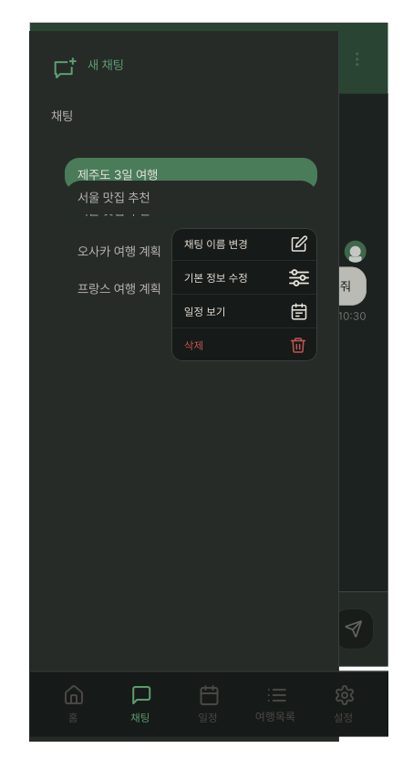
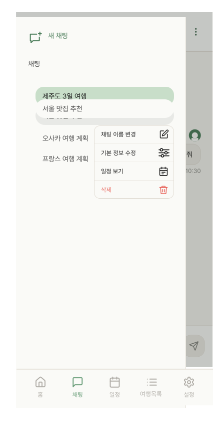

# NavigationDrawer

## 개요

ChatHeader 햄버거(≡) 탭 시 좌측에서 슬라이드인하는 사이드 드로어.
닫기 버튼 없음 — 바깥 영역(scrim) 탭으로 닫힘.

## Variants

| Variant | 설명 |
|---|---|
| Light | 라이트 모드 |
| Dark | 다크 모드 |

## 구성

```
┌─────────────────────────────┐
│ [+] 새 채팅                  │ ← 새 채팅 버튼
│                             │
│ 채팅                         │ ← 섹션 라벨
│   ● 제주도 3일 여행   [⋯]    │ ← 현재 선택된 채팅 (강조)
│   서울 맛집 추천             │
│   오사카 여행 계획           │
│   프랑스 여행 계획           │
└─────────────────────────────┘
```

## 스타일

| 속성 | Light | Dark |
|---|---|---|
| 너비 | `min(screen * 0.85, 340px)` | 동일 |
| 배경 | `Light/Surface,Card BG` | `Dark/Surface,Card BG` |
| 우측 border | `1px solid Light/Divider,Border` | `1px solid Dark/Divider,Border` |
| Elevation | `Light/elevation-4` | `Dark/elevation-4` |
| Scrim | `scrim-drawer` | `scrim-drawer` |
| 새 채팅 텍스트 | `body-md` / `Light/Primary,CTA Button` | `body-md` / `Dark/Primary,CTA Button` |
| 섹션 라벨 | `body-md` / `Light/Sub-heading` | `body-md` / `Dark/Sub-heading` |
| 채팅명 (비활성) | `body-md` / `Light/Sub-heading` | `body-md` / `Dark/Sub-heading` |
| 채팅명 (활성) | `body-md` / `Light/Title,Body Text` | `body-md` / `Dark/Title,Body Text` |
| 활성 채팅 배경 | `Light/Primary Tint,Tag BG` | `Dark/Primary Hover,Active` |
| 활성 채팅 Elevation | `Light/elevation-4` | `Dark/elevation-4` |
| 활성 채팅 Border Radius | `radius-lg` | `radius-lg` |
| 새 채팅 아이콘(ic_plus_chat) 색상 | `Light/Primary,CTA Button` | `Dark/Primary,CTA Button` |

## 동작

- 좌측에서 슬라이드인
- **scrim 탭 → 닫힘** (별도 닫기 버튼 없음)
- "새 채팅" 탭 → 새 채팅 시작
- 채팅 항목 탭 → 해당 채팅으로 이동
- **채팅 항목 롱프레스 → 진동 햅틱 (`'툭'` 짧게) + OverflowMenu 표시**

## 롱프레스 컨텍스트 메뉴
 
채팅 항목 롱프레스로 OverflowMenu 트리거.
 
| 항목 | 동작 |
|---|---|
| 채팅 이름 변경 | RenameChatModal 오픈 |
| 기본 정보 수정 | TripInfoBottomSheet (Edit) 오픈 |
| 일정 보기 | PlanDetailScreen 진입 |
| 삭제 | ChatDeleteAlert 오픈 |
 
**메뉴 위치:** 롱프레스한 채팅 항목 오른쪽 하단 고정.

## 너비 처리

340px 고정 대신 화면 너비 비율로 처리. 폰 사이즈마다 다르게 대응.

## 관련 아이콘 추가후, 경로 추가
`assets/icons/ic_plus_chat.svg`

## 이미지

### Navigation Drawer Dark


### Navigation Drawer Light
