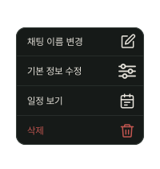
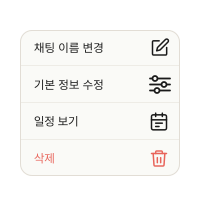

# OverflowMenu

## 개요

ChatHeader Active의 ⋯ 버튼 탭 시 나타나는 드롭다운 메뉴.

## Variants

| Variant | 설명 |
|---|---|
| Light | 라이트 모드 |
| Dark | 다크 모드 |

## 메뉴 항목

| 항목 | 동작 |
|---|---|
| 채팅방 이름 변경 | RenameChatModal 오픈 |
| 기본 정보 수정 | TripInfoBottomSheet(Edit) 오픈 |
| 일정 보기 | PlanListDetailScreen 진입 |
| 채팅 삭제 | Alert(ChatDeleteAlert) 오픈 |

## 스타일

| 속성 | Light | Dark |
|---|---|---|
| 너비 | 160px | 160px |
| 배경 | `Light/Surface,Card BG` | `Dark/Surface,Card BG` |
| Border Radius | `radius-md` | `radius-md` |
| Elevation | `Light/elevation-4` | `Dark/elevation-4` |
| 메뉴 텍스트 | `caption` / `Light/Title,Body Text` | `caption` / `Dark/Title,Body Text` |
| 삭제 텍스트 | `caption` / `Light/Danger,Logout` | `caption` / `Dark/Danger,Logout` |
| 구분선 | `1px solid Light/Divider,Border` | `1px solid Dark/Divider,Border` |
| 이름변경/정보수정/일정보기 아이콘 색상 | `Light/Title,Body Text` | `Dark/Title,Body Text` |
| 삭제 아이콘 색상 | `Light/Danger,Logout` | `Dark/Danger,Logout` |

> Scrim 없음 — 외부 탭 시 바로 닫힘 (Alert, BottomSheet와 달리 scrim 미사용)

## 트리거 방식
 
| 위치 | 트리거 | 메뉴 위치 |
|---|---|---|
| ChatHeader | ⋯ 버튼 탭 | 우상단 앵커 |
| NavigationDrawer 채팅 항목 | 롱프레스 + 햅틱 | 해당 항목 오른쪽 하단 |

## 관련 아이콘 추가후, 경로 추가
`assets/icons/ic_rename.svg`

`assets/icons/ic_edit_info.svg`

`assets/icons/ic_view_plan.svg`

`assets/icons/ic_delete.svg`

## 이미지

### Overflow Menu Dark

### Overflow Menu Light
