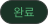
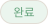

# ScheduleStatusBadge

## 개요

일정 상태 표시 배지.

읽기 전용, 인터랙션 없음.

배경색 + 텍스트 구조.

DayScheduleItem, MainScreen(RecentTravelSection) 에서 사용.

> **StatusToggle과 차이:** ScheduleStatusBadge는 읽기 전용. StatusToggle은 탭으로 상태 전환 가능.

## Variants

| Variant | 텍스트 | 설명 |
|---|---|---|
| `draft` / Light | 예정 | 라이트 |
| `draft` / Dark | 예정 | 다크 |
| `completed` / Light | 완료 | 라이트 |
| `completed` / Dark | 완료 | 다크 |

## 스타일

| 상태 | 배경 (Light) | 텍스트 (Light) | 배경 (Dark) | 텍스트 (Dark) |
|---|---|---|---|---|
| `draft` | `Light/Pending BG` | `Light/Pending,Warning` | `Dark/Pending BG` | `Dark/Pending,Warning` |
| `completed` | `Light/Success BG` | `Light/Success,Complete` | `Dark/Success BG` | `Dark/Success,Complete` |

- **크기:** 고정 크기 없음 — `paddingHorizontal: 12`, `paddingVertical: 3` 으로 콘텐츠에 맞게 자동
- **Border Radius:** `radius-lg`
- **Typography:** `caption`
- **FontFamily:** `Pretendard-Bold` 로 덮어씌우기

## 이미지

### Schedule Status Badge Completed Dark/Light

### Schedule Status Badge Draft Dark/Light

