# TripInfoBottomSheet

## 개요

여행 정보 입력/수정 바텀시트.

새 채팅 시작 시(Create) 또는 여행 정보 수정 시(Edit) 사용.

## Variants

**모드:** Create / Edit

**상태:**

| 상태 | 설명 |
|---|---|
| empty | 입력 전 초기 상태 |
| filled | 입력 완료 |
| calendar_expanded | 날짜 캘린더 펼쳐진 상태 |
| people_expanded1 | 인원 드롭다운 열림, 아동 없음 → 나이 드롭다운 미표시 |
| people_expanded2 | 인원 드롭다운 열림, 아동 있음 → 아동별 나이 선택 드롭다운 자동 표시 |
| age_dropdown | 나이대 드롭다운 |

**테마:** Light / Dark

## 입력 항목

- 여행지
- 여행 날짜 (시작 ~ 종료)
- 인원 수(성인, 아동) → 아동 수가 1명 이상이면 아동별 나이 선택 드롭다운 자동 표시
- 나이대(아동 인원 수에 따라 동적 생성)
- 예산

## 스타일

| 속성 | Light | Dark |
|---|---|---|
| 상단 Border Radius | 32px | 32px |
| 상단 텍스트(여행 정보를 입력해주세요) | `heading-xl` | `heading-xl` |
| 배경 | `Light/Page Background` | `Dark/Page Background` |
| Scrim | `scrim-modal` | `scrim-modal` |
| 입력창 배경 | `Light/Surface,Card BG` | `Dark/Surface,Card BG` |
| 입력창 Border Radius | `radius-lg` | `radius-lg` |
| 입력창 Border | `1px solid Light/Divider,Border` | `1px solid Dark/Divider,Border` |
| 입력창 Elevation | `Light/elevation-4` | `Dark/elevation-4` |
| 라벨 | `heading-sm` / `Light/Caption,Hint` | `heading-sm` / `Dark/Caption,Hint` |
| 입력값 | `heading-sm` / `Light/Title,Body Text` | `heading-sm` / `Dark/Title,Body Text` |
| 활성 아이콘 색상 | `Light/Title,Body Text` | `Dark/Title,Body Text` |
| 비활성 아이콘 색상 | `Light/Caption,Hint` | `Dark/Caption,Hint` |

## Validation
 
모든 필드가 입력 완료됐을 때만 `PrimaryButton` 활성화.
 
| 필드 | 조건 |
|---|---|
| 여행지 | 단순 텍스트 입력 방지를 위해 추후 여행지 검색 API 반환값에 대한 내용으로 검증. |
| 여행 날짜 | 시작일, 종료일 모두 선택 |
| 인원 | 성인 1명 이상 |
| 나이대 | 아동 수 > 0인 경우 아동별 나이 모두 선택 |
| 예산 | 0 초과 |

> TripInfoBottomSheetCreate와 TripInfoBottomSheetEdit 다른 점은 PrimaryButton Label의 텍스트가 다르다는 점 하나뿐이다.

## 동작
- 모든 필드 입력 완료 시 하단 PrimaryButton 활성화
- 아동 인원 수 > 0 → 아동별 나이 선택 드롭다운 자동 추가
- 필드 입력이 완벽한지 체크 후, Screen으로 올려보냄.

## 관련 아이콘 추가후, 경로 추가
`assets/icons/ic_search.svg`

`assets/icons/ic_plan.svg`

`assets/icons/ic_chevron_down.svg` → 인원 드롭다운이 열렸을 경우, 반시계 방향으로 180도 회전을 주어서 Up 상태를 만들어 재사용합니다.(+Animation)

## 이미지

### Trip Info Bottom Sheet Create Dark 
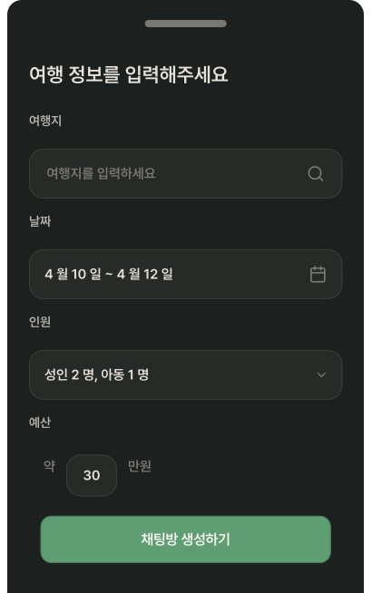
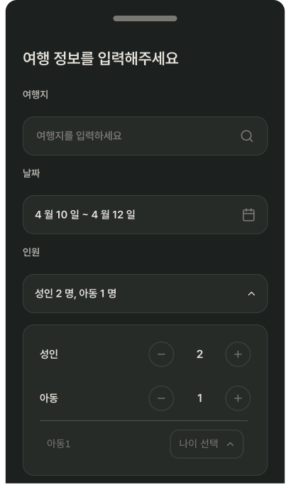
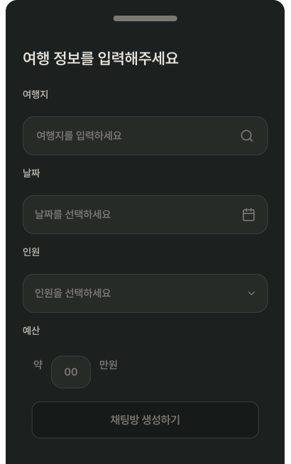
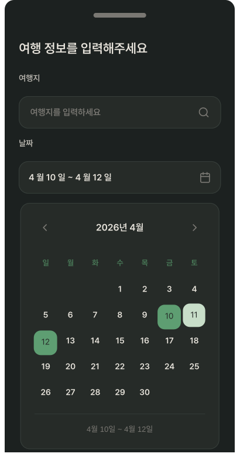
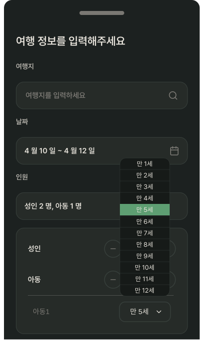
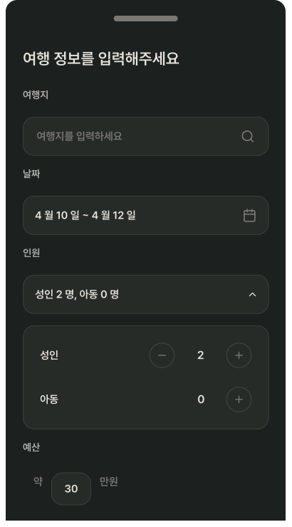

### Trip Info Bottom Sheet Create Light 
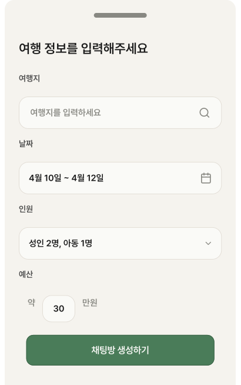
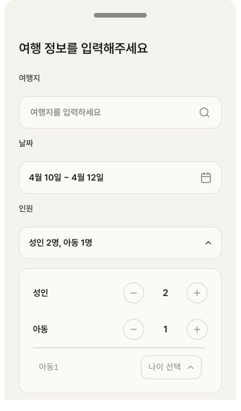
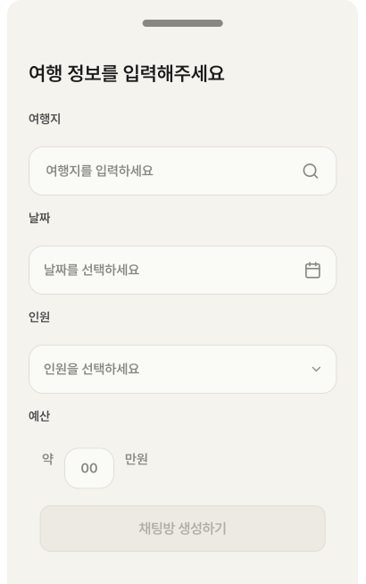
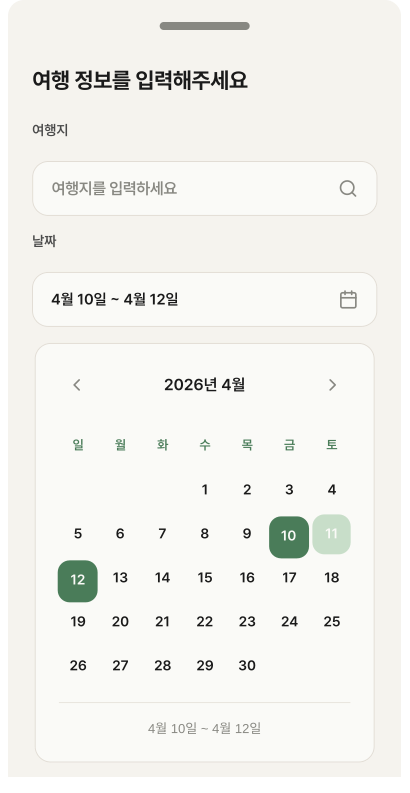
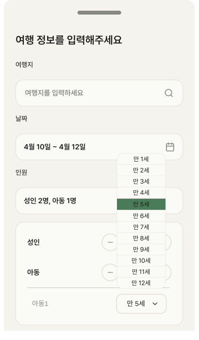
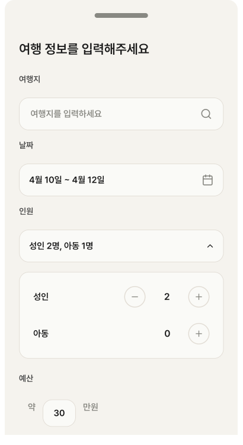

### Trip Info Bottom Sheet Edit Dark 
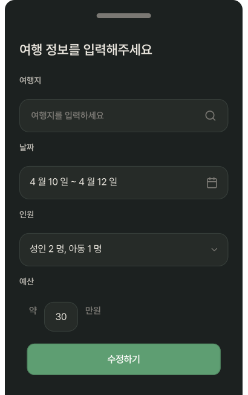

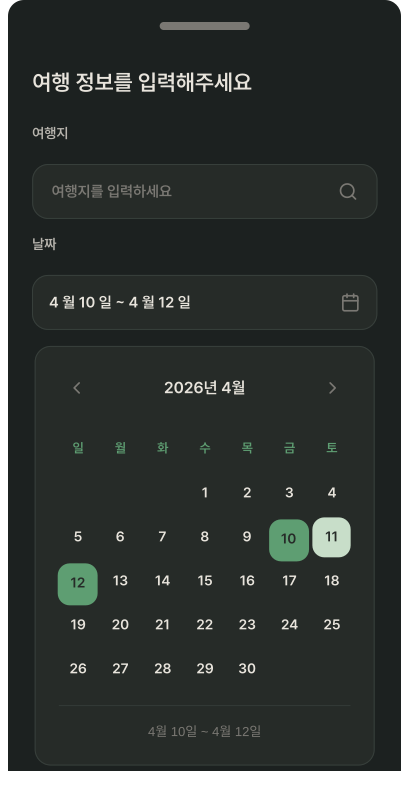

### Trip Info Bottom Sheet Edit Light 
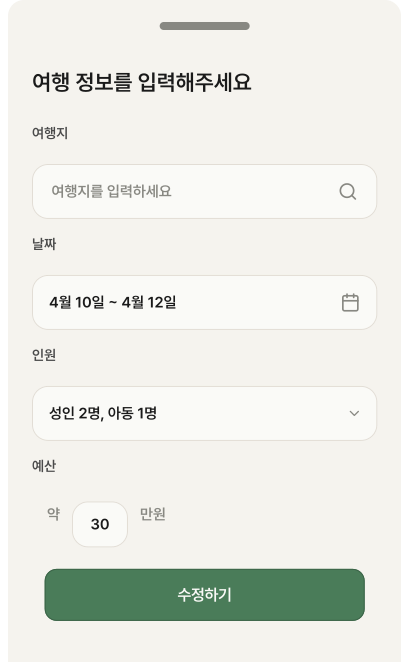

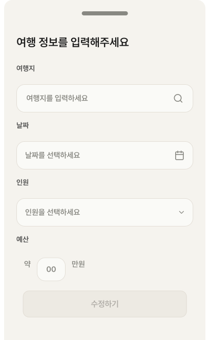
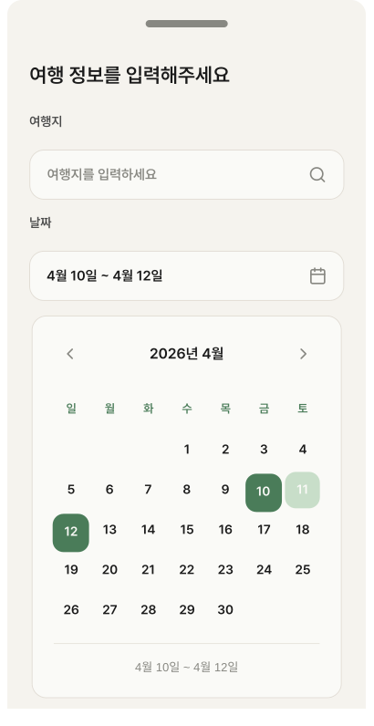

