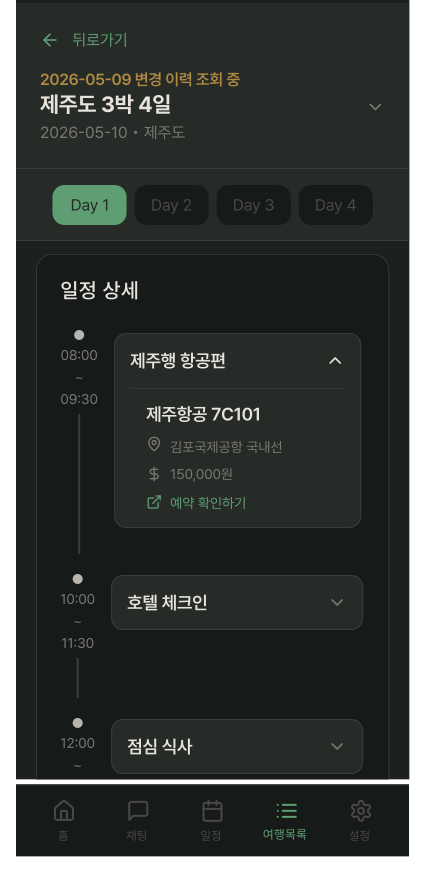
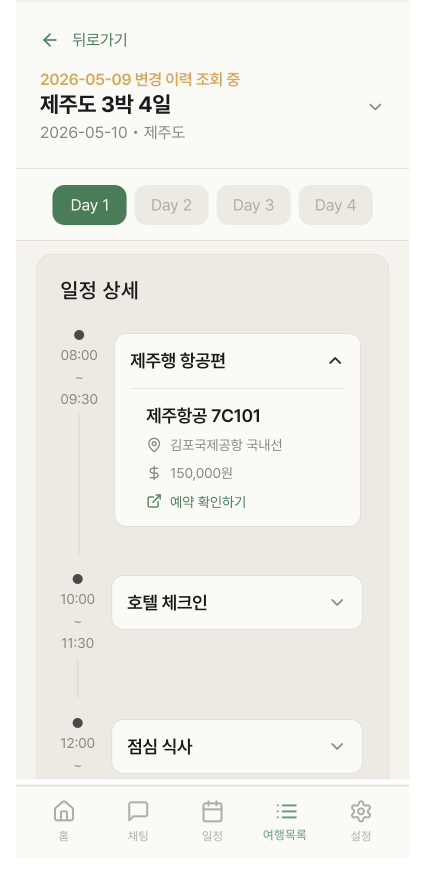

# ChangeLogDetailScreen

## 개요

특정 날짜의 일정 변경 이력을 조회하는 화면.
`ItineraryOverviewCard2-BeforeEdit`에서 변경 이력 날짜 탭 시 진입.
해당 날짜 기준 일정 스냅샷을 **읽기 전용**으로 표시.

## Variants

| Variant | 설명 |
|---|---|
| Light | 라이트 모드 |
| Dark | 다크 모드 |

## 구성 컴포넌트

- `ItineraryOverviewCard2-BeforeEdit` — 재사용. `changeLogDate` prop 전달 → 변경 이력 조회 중 표시 + 편집 버튼 숨김
- 변경 이력 조회 중 표시 배너
- `PlanDetailItem` × N — 해당 날짜 스냅샷 일정 목록 (읽기 전용, map 렌더링)

## 레이아웃

```
┌──────────────────────────────────────┐
│ ← 뒤로가기                           │
│ 2026-05-09 변경 이력 조회 중          │ ← Pending 색상 서브텍스트
│ 제주도 3박 4일                      ∨ │ ← chevron (접힘/펼침, 변경이력 없음)
│ 2026-05-10 • 제주도                  │
├──────────────────────────────────────┤
│ [Day 1]  Day 2   Day 3   Day 4       │
├──────────────────────────────────────┤
│                                      │
│       PlanDetailItem × N             │ ← 스크롤, 읽기 전용
│    (해당 날짜 기준 스냅샷)           │
│                                      │
└──────────────────────────────────────┘
```

## 변경 이력 조회 중 표시

여행명 위에 날짜 + "변경 이력 조회 중" 텍스트로 현재 상태 명시.

| 속성 | Light | Dark |
|---|---|---|
| 텍스트 | `{날짜} 변경 이력 조회 중` | 동일 |
| 색상 | `Light/Pending,Warning` | `Dark/Pending,Warning` |
| Typography | `heading-sm` | `heading-sm` |

## 동작

- 모든 일정 항목 읽기 전용 — 편집 불가
- 편집 버튼 없음
- ← 뒤로가기 → PlanListDetailScreen 복귀
- Day 탭 → 해당 일차 스냅샷으로 스크롤 이동

## 스타일

| 속성 | Light | Dark |
|---|---|---|
| 배경 | `Light/Secondary Surface` | `Dark/Secondary Surface` |

## 이미지



