# ChatScreen

## 개요

AI와 여행 계획을 대화하는 채팅 화면.

## Variants / 상태

| 상태 | 설명 |
|---|---|
| NewChatScreen | 새 채팅 시작 전. ChatHeader Default, TripInfoBottomSheet |
| ChatScreen | 채팅 진행 중. ChatHeader Active |
| ChatScreenInputFilled | 메시지 입력됨. TypeMessageWindow 활성 |
| ChatNavigationDrawer | NavigationDrawer 열린 상태 |
| ChatNavigationDrawerOverflowMenu | NavigationDrawer에서 OverflowMenu 열린 상태 |
| ChatOverflowMenu | OverflowMenu 열린 상태 |
| ChatDelete | 채팅 삭제 Alert |
| EditChatNameScreen | 채팅 이름 변경 모달(RenameChatModal) |
| EditTripInfoScreenEnabled | 여행 기본 정보 수정 가능(TripInfoBottomSheet) |
| EditTripInfoScreenDisabled | 여행 기본 정보 수정 불가능(TripInfoBottomSheet) |

## 구성 컴포넌트

- `ChatHeader` — Default / Active
- `ChatBubble` (AIAgentChat / UserChat)
- `TypeMessageWindow` + `ChatSendButton`
- `TripInfoBottomSheet` (Create / Edit)
- `NavigationDrawer`
- `OverflowMenu`
- `Alert` (ChatDeleteAlert)
- `RenameChatModal`
- `BottomNavigation` — 채팅 탭 활성

## 레이아웃

```
┌─────────────────────┐
│     ChatHeader      │ ← 78px + insets.top 고정
├─────────────────────┤
│                     │
│    Chat Messages    │ ← 스크롤 영역
│  (AI + User 버블)   │
│                     │
├─────────────────────┤
│  TypeMessageWindow  │ ← 하단 고정
├─────────────────────┤
│   BottomNavigation  │ ← 72px + insets.bottom 고정
└─────────────────────┘
```

## 포함된 서브 플로우

- **EditChatNameScreen** — RenameChatModal 오버레이로 처리 (별도 화면 아님)
- **EditTripInfoScreen** — TripInfoBottomSheet (Edit) 오버레이로 처리 (별도 화면 아님)

## 스타일

| 속성 | Light | Dark |
|---|---|---|
| 배경 | `Light/Page Background` | `Dark/Page Background` |

## 이미지

### ChatScreen Dark
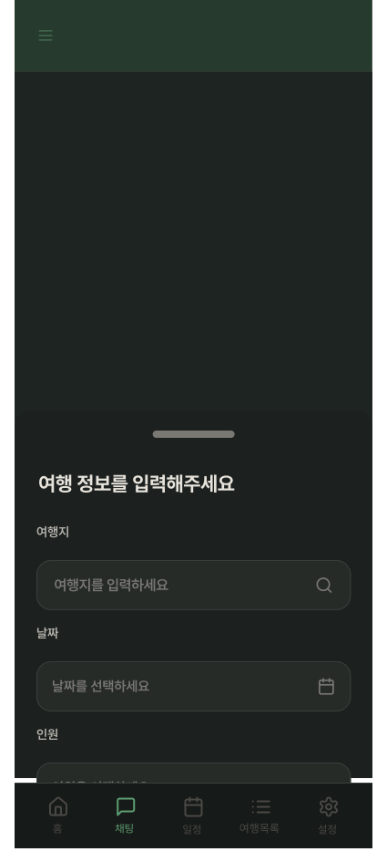
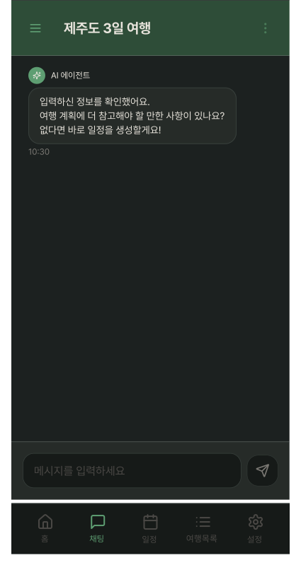
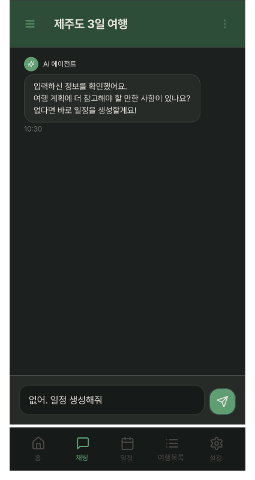
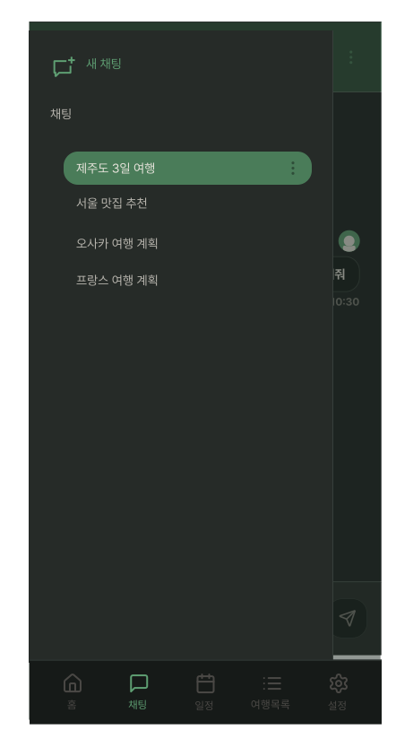
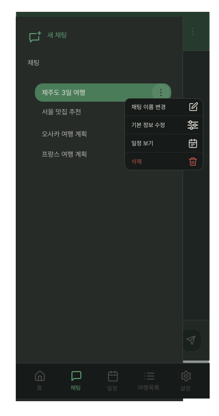
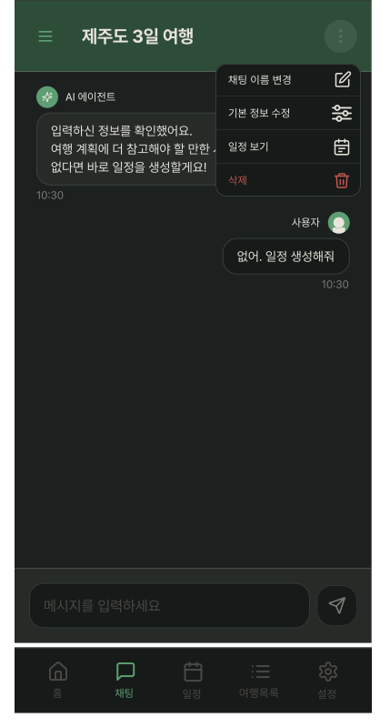
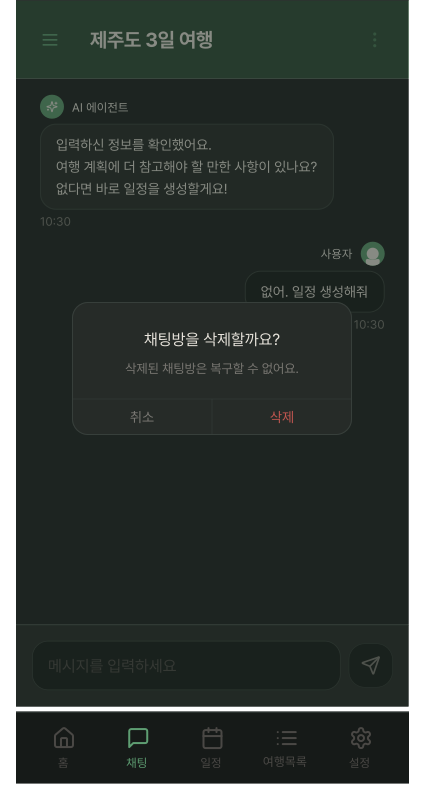
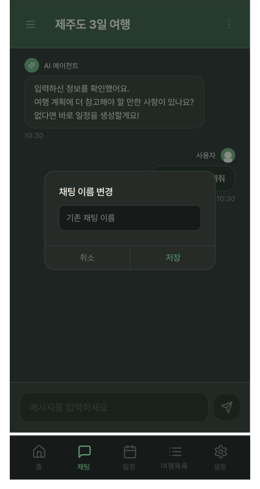
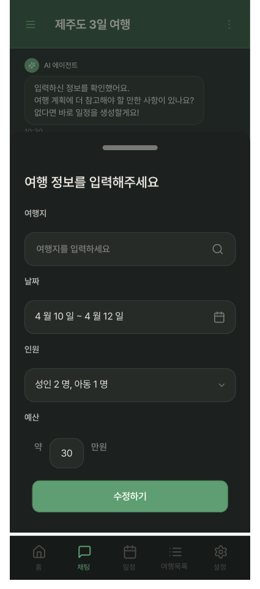
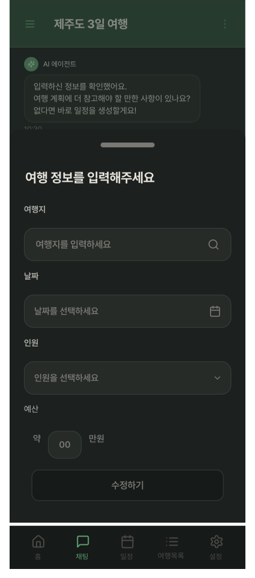

### ChatScreen Light
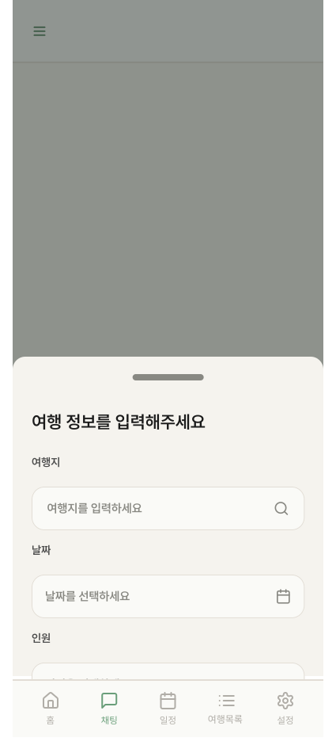
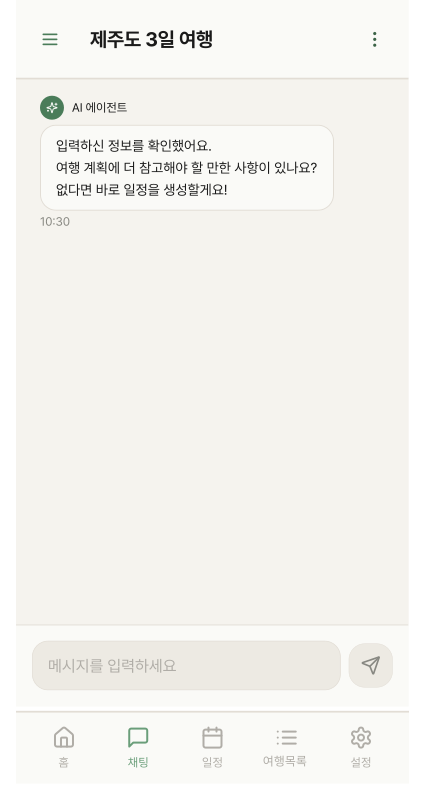
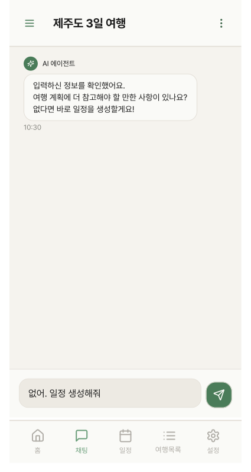
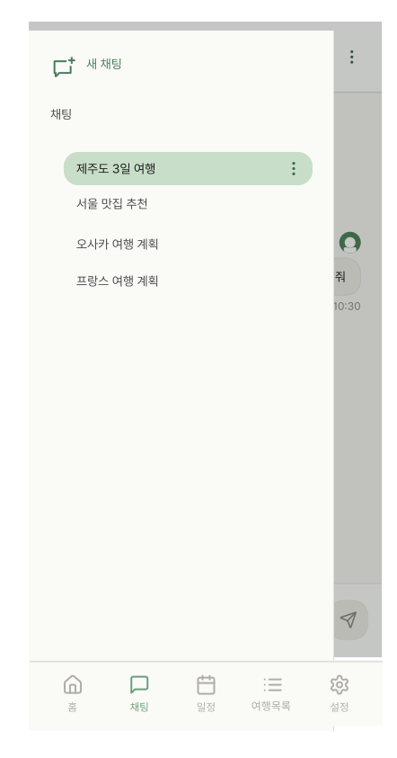
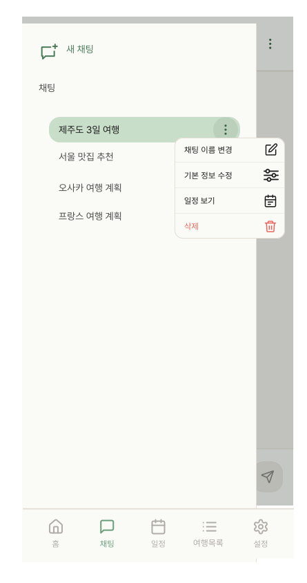
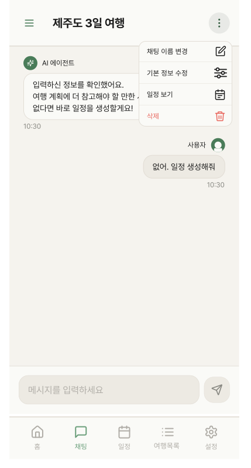
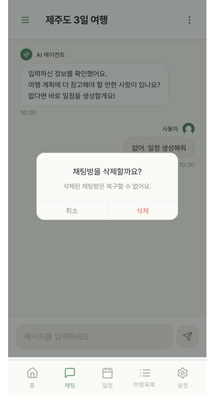
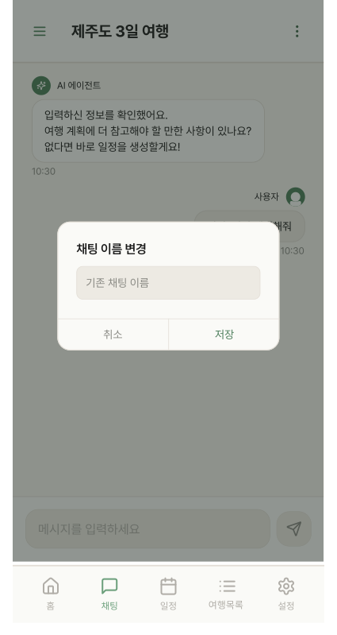
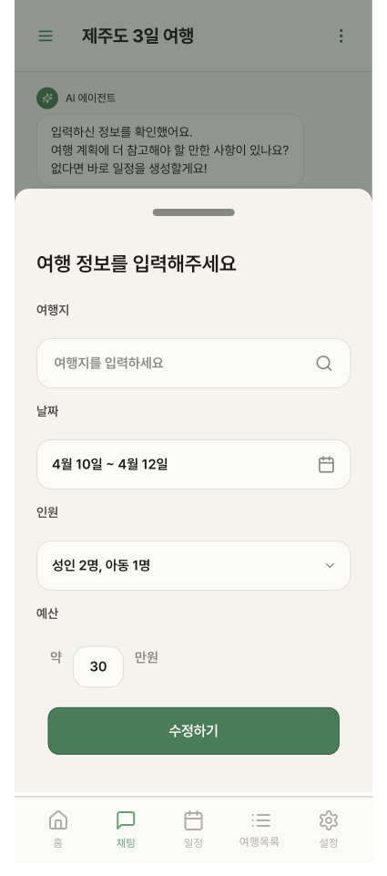
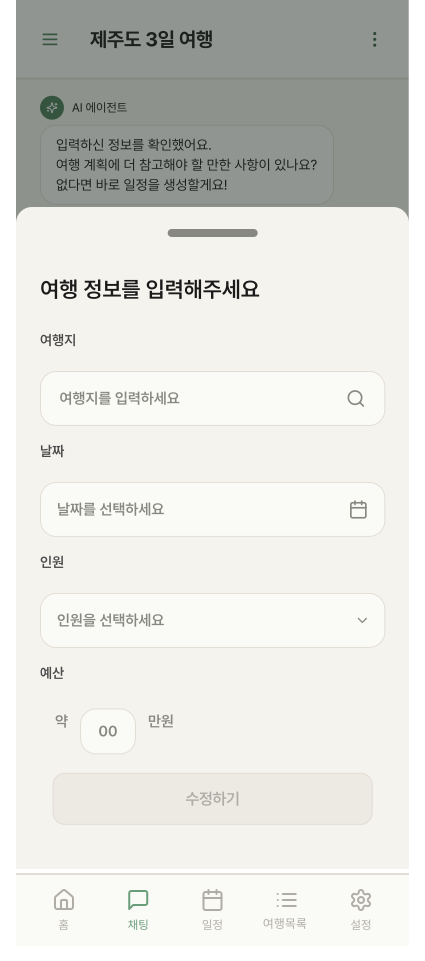