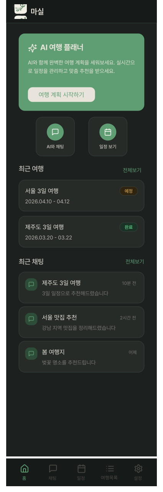
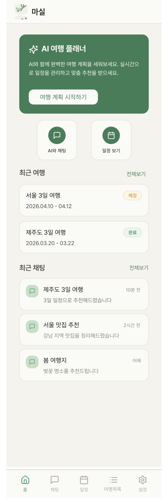

# HomeScreen

## 개요

앱 진입 시 첫 화면.

## Variants

| Variant | 설명 |
|---|---|
| Light | 라이트 모드 |
| Dark | 다크 모드 |

## 구성 컴포넌트

- `Header` — 로고 + "마실" 상단 고정
- `HomeAIBanner` — AI 여행 플래너 배너
- `QuickMenu` — AI와 채팅 / 일정 보기 퀵메뉴
- `RecentTravelSection` — 최근 여행 카드 목록 + 전체보기
- `RecentChatSection` — 최근 채팅 목록 + 전체보기
- `BottomNavigation` — 홈 탭 활성

## 레이아웃

```
┌─────────────────────┐
│       Header        │ ← 60px + insets.top 고정
├─────────────────────┤
│                     │
│    HomeAIBanner     │
│      QuickMenu      │  ← 스크롤 영역
│ RecentTravelSection │
│  RecentChatSection  │
│                     │
├─────────────────────┤
│   BottomNavigation  │ ← 72px + insets.bottom 고정
└─────────────────────┘
```

## 스타일

| 속성 | Light | Dark |
|---|---|---|
| 배경 | `Light/Page Background` `#F5F3EE` | `Dark/Page Background` |

## 이미지

### Home Screen Dark


### Home Screen Light
