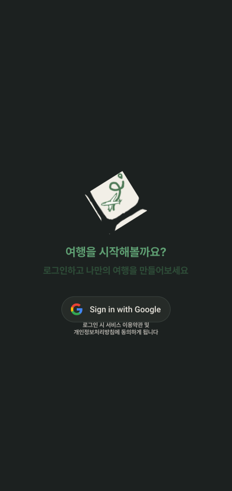
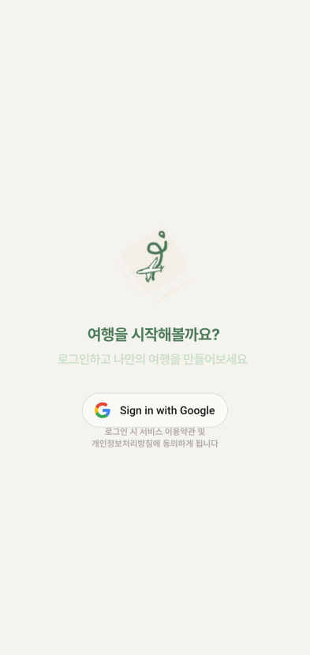

# LoginScreen

## 개요

앱 최초 진입 로그인 화면. Google 소셜 로그인.

## Variants

| Variant | 설명 |
|---|---|
| Light | 라이트 모드 |
| Dark | 다크 모드 |

## 구성

- 앱 로고
- 타이틀: "여행을 시작해볼까요?"
- 부제: "로그인하고 나만의 여행을 만들어보세요"
- Google Sign In 버튼 (`assets/brand/google_sign_in_dark.svg`, `assets/brand/google_sign_in_light.svg`)
- 약관 안내 텍스트

## 스타일

| 속성 | Light | Dark |
|---|---|---|
| 메인 로고 | 32도 회전 | 32도 회전 |
| 배경 | `Light/Page Background` | `Dark/Page Background` |
| 타이틀 | `heading-lg` / `Light/Primary,CTA Button` | `heading-lg` / `Dark/Primary,CTA Button` |
| 부제 | `heading-sm` / `Light/Primary Tint,Tag BG` | `heading-sm` / `Dark/Primary Tint,Tag BG` |
| 약관 | `label` / **FontFamily:** Pretendard-Bold 로 덮어씌우기 / `Light/Placeholder,Disabled` | `label` / **FontFamily:** Pretendard-Bold 로 덮어씌우기 / `Dark/Placeholder,Disabled` |

## GoogleSignIn 버튼

Figma에 `GoogleSignIn` 컴포넌트로 분리돼있으나 LoginScreen 전용.

Google 공식 버튼 에셋 사용(구글 브랜드 가이드라인에 맞춘 '마실' 색상 커스텀)

| 속성 | Light | Dark |
|---|---|---|
| Elevation | `Light/elevation-4` | `Dark/elevation-4` |

## 관련 아이콘 추가후, 경로 추가
`assets/images/img_logo_main.svg`

`assets/brand/google_sign_in_dark.svg`

`assets/brand/google_sign_in_light.svg`

## 이미지

### Login Screen Dark

### Login Screen Light
