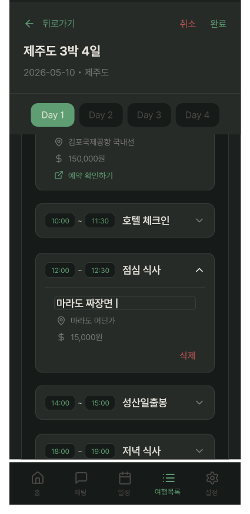
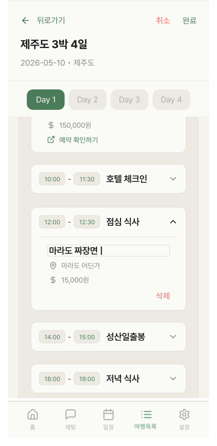

# PlanDetailEditScreen

## 개요

여행 일정 편집 화면.

PlanDetailScreen "편집" 버튼 탭 시 진입.

헤더 Sticky 고정, 일정 목록만 스크롤.

## Variants

| Variant | 설명 |
|---|---|
| Light | 라이트 모드 |
| Dark | 다크 모드 |

## 구성 컴포넌트

- `ItineraryOverviewCard2Editing` — 상단 Sticky 헤더 (취소/완료 버튼 항상 보임)
- `PlanDetailEditItem` × N — 인라인 편집 아코디언 카드 (map 렌더링)
- `BottomNavigation` — 여행목록 탭 활성

## 레이아웃

```
┌─────────────────────────────────────┐
│   ItineraryOverviewCard2Editing    │ ← Sticky 고정
├─────────────────────────────────────┤
│                                     │
│       PlanDetailEditItem × N        │ ← 스크롤 (activities.map)
│                                     │
├─────────────────────────────────────┤
│          BottomNavigation           │
└─────────────────────────────────────┘
```

## 저장 플로우

모든 변경사항은 로컬 상태에만 반영. "완료" 버튼 탭 시 한번에 서버 PATCH.

```
편집 (onBlur / 삭제)
    ↓
Screen 로컬 상태 업데이트
    ↓
"완료" 버튼 탭
    ↓
서버 PATCH
    ↓
PlanDetailScreen 복귀
```

- "취소" → 로컬 상태 버리고 원래 데이터로 복원 후 PlanDetailScreen 복귀
- 개별 항목 동작은 `PlanDetailEditItem` 문서 참조

## 구현 주의사항

- `KeyboardAvoidingView` 필수

## 스타일

| 속성 | Light | Dark |
|---|---|---|
| 배경 | `Light/Page Background` | `Dark/Page Background` |

## 이미지

### My Travel Plan List Detail Edit Screen Dark


### My Travel Plan List Detail Edit Screen Light
