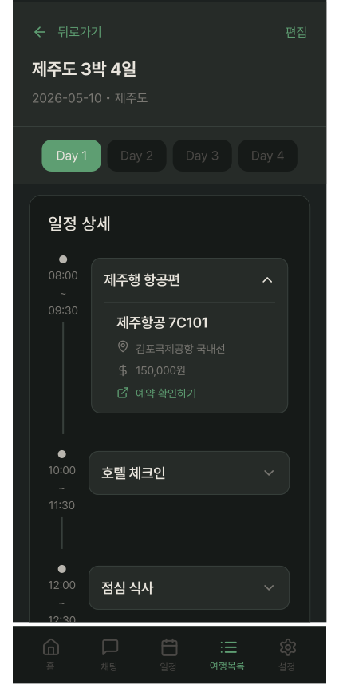
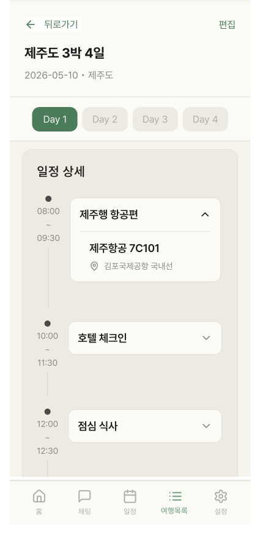

# PlanDetailScreen

## 개요

여행 상세 조회 화면.

여행 개요 헤더 + 타임라인 아코디언 목록.

## Variants

| Variant | 설명 |
|---|---|
| Light | 라이트 모드 |
| Dark | 다크 모드 |

## 구성 컴포넌트

- `ItineraryOverviewCard2BeforeEdit` — 상단 헤더 (Hide on scroll up / Show on scroll down)
- `PlanDetailItem` × N — 타임라인 아코디언 카드 (map 렌더링)
- `BottomNavigation` — 여행목록 탭 활성

## 레이아웃

```
┌─────────────────────────────────────┐
│   ItineraryOverviewCard2BeforeEdit │ ← Hide/Show on scroll
├─────────────────────────────────────┤
│                                     │
│         PlanDetailItem × N          │ ← 스크롤 (activities.map)
│    (도트 + 세로선 + 아코디언 카드)  │
│                                     │
├─────────────────────────────────────┤
│          BottomNavigation           │
└─────────────────────────────────────┘
```

## 동작

- `PlanDetailItem` ∨ 탭 → 펼쳐져 상세 정보 표시 (읽기 전용)
- "편집" 버튼 탭 → PlanDetailEditScreen 진입
- 스크롤 내릴 때 헤더 숨김, 올릴 때 다시 표시

## 스타일

| 속성 | Light | Dark |
|---|---|---|
| 배경 | `Light/Secondary Surface` | `Dark/Secondary Surface` |

## 이미지

### My Travel Plan List Detail Screen Dark


### My Travel Plan List Detail Screen Light
