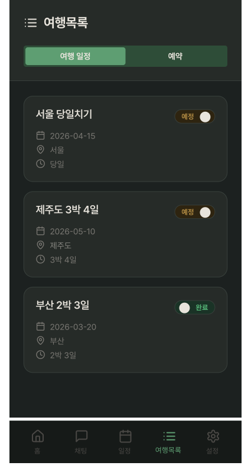
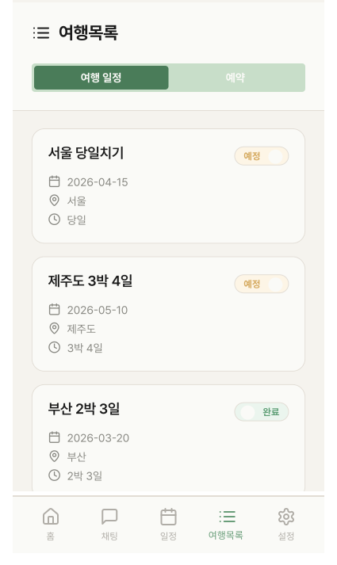
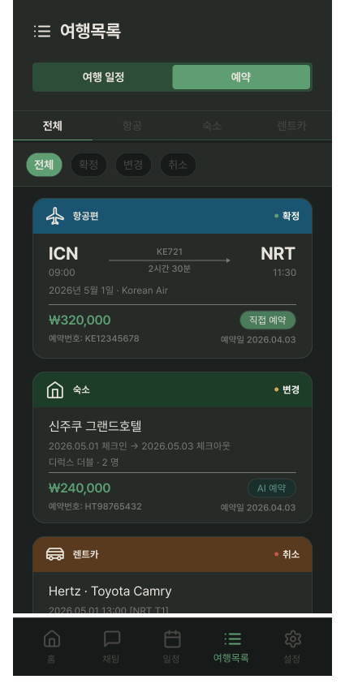
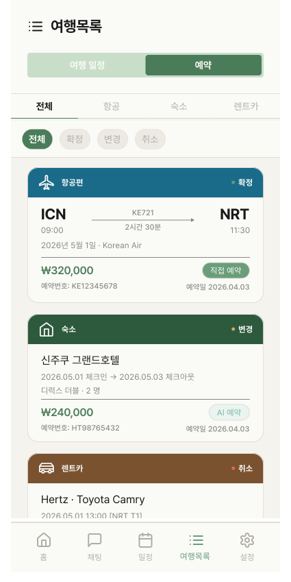

# PlanListScreen

## 개요

내 여행 목록 화면. 여행 일정 탭 / 예약 탭 전환.

## Variants

| Variant | 설명 |
|---|---|
| Light / 일정 탭 | 라이트, 여행 목록 |
| Light / 예약 탭 | 라이트, 예약 목록 |
| Dark / 일정 탭 | 다크, 여행 목록 |
| Dark / 예약 탭 | 다크, 예약 목록 |

## 구성 컴포넌트

- `TravelListTabBar` — 여행목록 헤더 + 일정/예약 탭 전환
- **일정 탭:** `TravelPlanCard` × N (map 렌더링)
- **예약 탭:** `ReservationTypeTab` + `ReservationStatusFilter` + `FlightReservationCard` / `LodgingReservationCard` / `CarReservationCard`
- `BottomNavigation` — 여행목록 탭 활성

## 레이아웃 (일정 탭)

```
┌──────────────────────────┐
│     TravelListTabBar     │ ← 여행목록 타이틀 + 탭 전환
├──────────────────────────┤
│      TravelPlanCard      │
│      TravelPlanCard      │ ← 스크롤 (plans.map)
│      TravelPlanCard      │
├──────────────────────────┤
│     BottomNavigation     │
└──────────────────────────┘
```

## 레이아웃 (예약 탭)

```
┌──────────────────────────┐
│     TravelListTabBar     │
├──────────────────────────┤
│     ReservationTypeTab   │ ← 전체/항공/숙소/렌트카
│  ReservationStatusFilter │ ← 전체/확정/변경/취소
├──────────────────────────┤
│  FlightReservationCard   │
│  LodgingReservationCard  │ ← 스크롤 (reservations.map)
│  CarReservationCard      │
├──────────────────────────┤
│     BottomNavigation     │
└──────────────────────────┘
```

## 동작

- `TravelPlanCard` 탭 → PlanDetailScreen 진입
- `ReservationTypeTab` 탭 → 해당 타입 카드만 필터링
- `ReservationStatusFilter` 탭 → 해당 상태 카드만 필터링

## 스타일

| 속성 | Light | Dark |
|---|---|---|
| 배경 | `Light/Page Background` | `Dark/Page Background` |

## 이미지

### My Travel Plan List Screen Plan Dark/Light



### My Travel Plan List Screen Reservation Dark/Light

