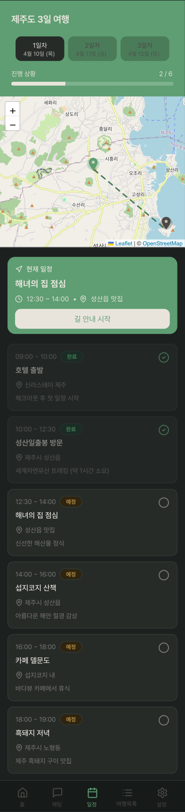
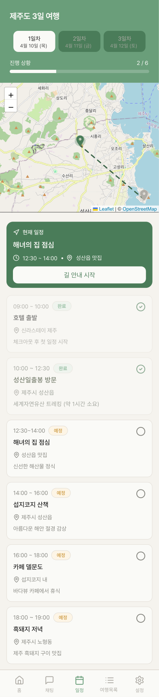
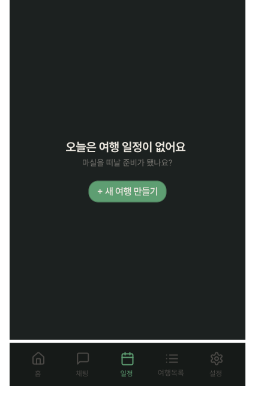
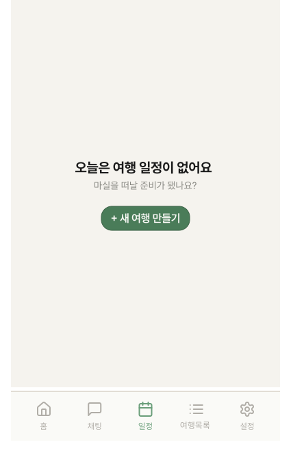

# PlanScreen

## 개요

여행 일정을 지도와 함께 보여주는 화면. 일차별 장소/활동 목록과 현재 일정을 표시.

## 구성 컴포넌트

- `ItineraryOverviewCard` — 상단 여행 개요 및 일차 선택
- 지도 (OpenStreetMap / Leaflet)
- `CurrentScheduleCard` — 지도 위 오버레이
- `DayScheduleItem` — 일별 일정 목록
- `BottomNavigation` — 하단 고정

## 상태

| 상태 | 설명 |
|---|---|
| WithSchedule | 일정이 있는 상태. ItineraryOverviewCard + 지도 + CurrentScheduleCard + DayScheduleItem 표시 |
| Empty | 일정이 없는 상태. "오늘은 여행 일정이 없어요" 제목 + "마실을 떠날 준비가 됐나요?" 부제목 + NewTravelGenerateButton 표시 |

## Empty 스타일
| 속성 | Light | Dark |
|---|---|---|
| 배경 | `Light/Page Background` | `Dark/Page Background` |
| 제목("오늘은 여행 일정이 없어요") | `heading-lg` / `Light/Title,Body Text` | `heading-lg` / `Dark/Title,Body Text` |
| 부제목("마실을 떠날 준비가 됐나요?") | `body-md` / `Light/Caption,Hint` | `body-md` / `Dark/Caption,Hint` |

## 레이아웃 (WithSchedule)

```
┌─────────────────────┐
│ ItineraryOverview   │ ← 여행명, 날짜, 일차 선택, 진행 상황
│       Card          │
├─────────────────────┤
│      지도            │ ← OpenStreetMap
├─────────────────────┤
│   CurrentSchedule   │ 
│        Card         │
│   DayScheduleItem   │ ← 스크롤 영역
│   DayScheduleItem   │
│        ...          │
├─────────────────────┤
│   BottomNavigation  │ ← 72px 고정
└─────────────────────┘
```

## 라이선스 표기 (필수)

OpenStreetMap은 ODbL 라이선스로 출처 표기가 필수. 지도 우측 하단에 아래 텍스트를 항상 표시해야 함.

```tsx
const { colors } = useTheme();

<Text style={{ ...Typography['label'], color: colors.textCaption }}>
  © OpenStreetMap contributors
</Text>
```

## 이미지

### Plan Screen Dark/Light



### Plan Screen Non Dark/Light

