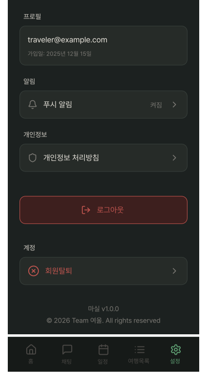
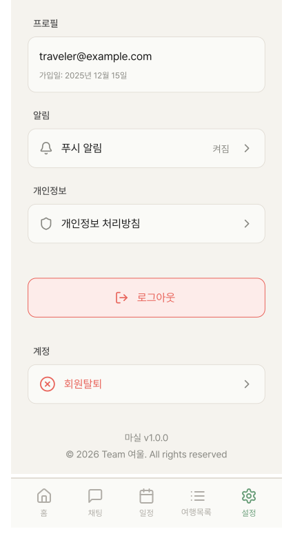

# SettingScreen

## 개요

앱 설정 화면.

## Variants

| Variant | 설명 |
|---|---|
| Light | 라이트 모드 |
| Dark | 다크 모드 |

## 구성 컴포넌트

- `Alert` (LogoutAlert) — 로그아웃 탭 시 오버레이
- `Alert` (DeleteAccountAlert) — 로그아웃 탭 시 오버레이
- `BottomNavigation` — 설정 탭 활성

## 설정 항목

- 프로필(이메일, 가입일)
- 알림 설정
- 개인정보 처리방침
- 로그아웃
- 회원탈퇴

## 스타일

| 속성 | Light | Dark | 포커스(Light/Dark) |
|---|---|---|---|
| 배경 | `Light/Page Background` | `Dark/Page Background` | - |
| 메뉴 카드 배경 | `Light/Surface,Card BG` | `Dark/Surface,Card BG` | - |
| 메뉴 카드 Border | `1px solid Light/Divider,Border` | `1px solid Dark/Divider,Border` | - |
| 메뉴 카드 Border Radius | `radius-md` | `radius-md` | - |
| 메뉴 텍스트 | `body-lg` / `Light/Title,Body Text` | `body-lg` / `Dark/Title,Body Text` | - |
| 프로필 가입일 텍스트 | `caption` / `Light/Caption,Hint` | `caption` / `Dark/Caption,Hint` | - |
| 로그아웃 텍스트 | `body-lg` / `Light/Danger,Logout` | `body-lg` / `Dark/Danger,Logout` | - |
| 로그아웃 카드 배경 | `Light/Danger BG` | `Dark/Danger BG` | - |
| 로그아웃 Border | `1px solid Light/Danger,Logout` | `1px solid Dark/Danger,Logout` | - |
| 회원탈퇴 텍스트 | `body-lg` / `Light/Danger,Logout` | `body-lg` / `Dark/Danger,Logout` | - |
| 로그아웃, 회원탈퇴 아이콘(ic_logout, ic_user_remove) 색상 | `Light/Danger,Logout` | `Dark/Danger,Logout` | - |
| 알림, 개인정보 아이콘(ic_notification, ic_privacy) 색상 | `caption` / `Light/Caption,Hint` | `caption` / `Dark/Caption,Hint` | - |
| 드롭다운 아이콘(ic_chevron_down) 색상 | `Light/Caption,Hint` | `Dark/Caption,Hint` | `Light/Title,Body Text` / `Dark/Title,Body Text` |

## 관련 아이콘 추가후, 경로 추가
`assets/icons/ic_notification.svg`

`assets/icons/ic_privacy.svg`

`assets/icons/ic_logout.svg`

`assets/icons/ic_user_remove.svg`

`assets/icons/ic_chevron_down.svg` → 드롭다운이 열렸을 경우, 반시계 방향으로 180도 회전을 주어서 Up 상태를 만들어 재사용합니다.(+Animation)

## 이미지

### Setting Screen Dark

### ### Setting Screen Light
